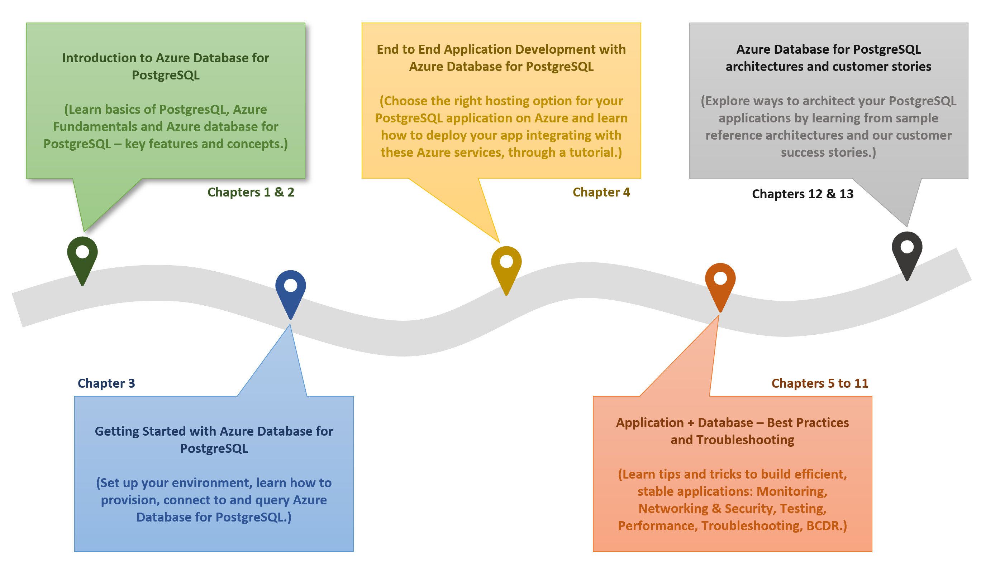

# 01 / Azure PostgreSQL Developer Guide

Welcome to developing [PostgreSQL](https://www.postgresql.org/)-based applications on [Microsoft Azure](https://portal.azure.com/)! Whether creating a production application or improving an existing enterprise system, this guide will take developers and architects through the fundamentals of PostgreSQL application development to more advanced architecture and design. From beginning to end, it is a content journey designed to help ensure current or future PostgreSQL systems are performing at their best even as their usage grows and expands.

The topics and flow contained in this guide cover the advantages of migrating to or leveraging various simple-to-use, valuable Azure cloud services in PostgreSQL architectures. Be prepared to learn how easy and quick it is to create applications backed by [Azure Database for PostgreSQL Flexible Server](https://learn.microsoft.com/azure/postgresql/flexible-server/overview). In addition to building customized services, developers will also be able to leverage the vast number of value-add services available in the [Azure Marketplace](https://azuremarketplace.microsoft.com/marketplace/). Throughout this developer journey, strive to leverage the vast number of resources presented rather than going at it alone!

Because every company and project is unique, this guide provides insightful service descriptions and tool comparisons to allow the reader to make choices that fit their environment, system, and budget needs. Proven industry architecture examples provide best practice jumpstarts allowing for solid architecture foundations and addressing potential compliance needs.

Development teams will understand best practices and efficient architecture and security practices – avoiding the problems and costs of poor design. Teams will gain the knowledge to automate builds, package, test, and deliver applications based on PostgreSQL to various hosting environments. By leveraging continuous integration and deployment (CI/CD), costs related to manual deployment tasks can be reduced or completely removed.

Many steps in the application lifecycle go beyond simply building and deploying an application. This guide will cover how easy it is to monitor system uptime and performance in the various Azure services. Administrators will appreciate the realistic and straightforward troubleshooting tips that help keep downtime to a minimum and users happy.

The ultimate goal is to successfully deploy a stable, performant PostgreSQL application running securely in Microsoft Azure using cloud best practices. Let us start the journey!
