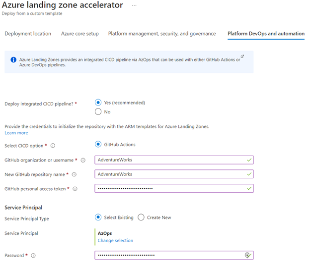
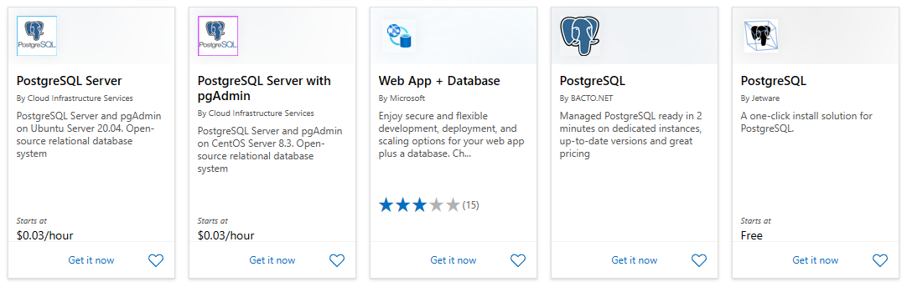
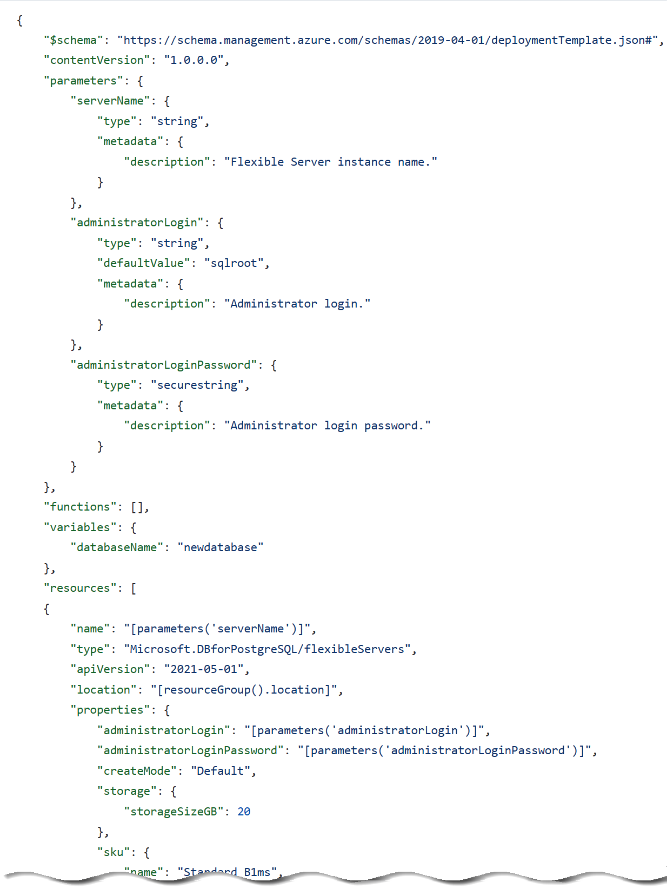
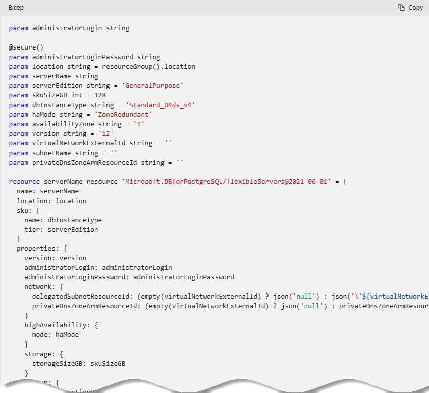
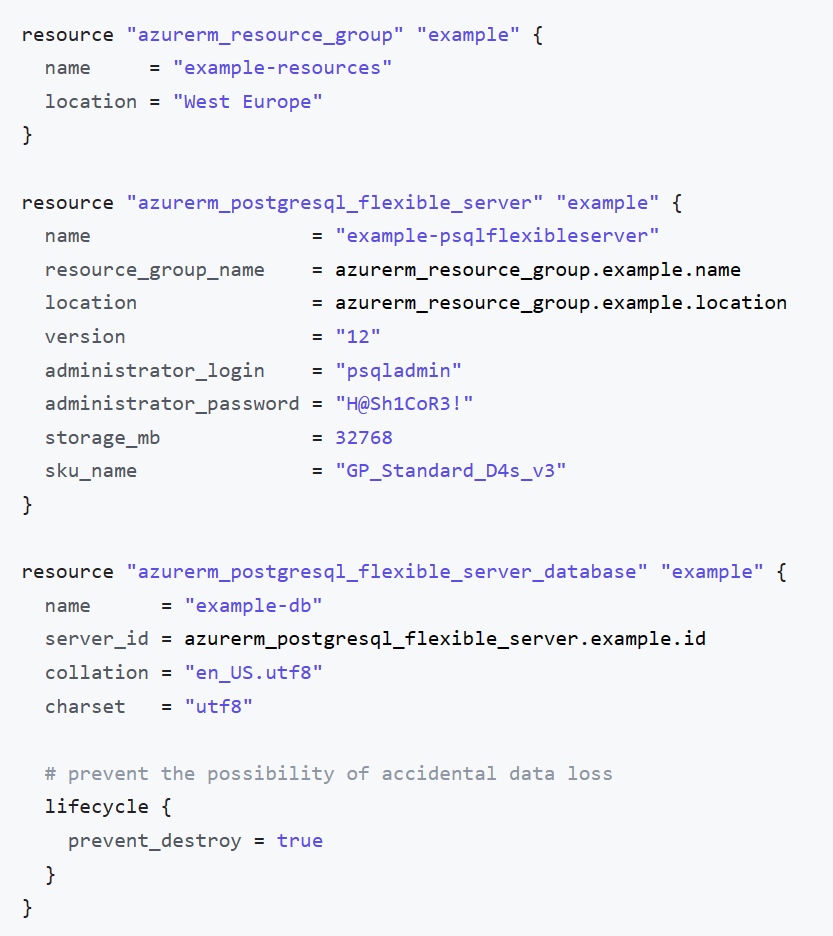

## Introduction to Azure resource management

With a firm understanding of why millions of organizations choose Azure, and the database deployment models (IaaS vs. PaaS), the next step is to provide more detail about **how** developers interact with Azure.

The [Azure Fundamentals Microsoft Learn Module](https://learn.microsoft.com/learn/modules/intro-to-azure-fundamentals/) demonstrates how IaaS and PaaS classify Azure services. Moreover, Azure empowers flexible *hybrid cloud* deployments and supports a variety of common tools, such as Visual Studio, PowerShell, and the Azure CLI, to manage Azure environments.

  

The following table outlines some of the Azure services used in application developer scenarios that will be discussed in further detail in later sections of this guide.

- **[Virtual Machines (IaaS)](https://learn.microsoft.com/azure/virtual-machines/windows/overview)**: Begin by running a PHP sample application on an Azure Windows Server Virtual Machine.
- **[Azure App Service (PaaS)](https://learn.microsoft.com/azure/app-service/overview)**: Deploy the PHP application to Azure App Service, a flexible, simple-to-use application hosting service.
- **[Azure Container Instances (PaaS)](https://learn.microsoft.com/azure/container-instances/container-instances-overview)**: *Containerize* apps on the VM to operate in an environment isolated from other development tools installed on the system. Azure Container Instances provides a managed environment to operate containers.
- **[Azure Kubernetes Service (PaaS)](https://learn.microsoft.com/azure/aks/intro-kubernetes)**: AKS also hosts containerized apps, but it is optimized for more advanced orchestration scenarios, such as high availability.

For a more comprehensive view, consult the [Azure Fundamentals Microsoft Learn](https://learn.microsoft.com/learn/modules/intro-to-azure-fundamentals/tour-of-azure-services) module.

### The Azure resource management hierarchy

Azure provides a flexible resource hierarchy to simplify cost management and security. This hierarchy consists of four levels:

- **[Management groups](https://learn.microsoft.com/azure/governance/management-groups/overview)**: Management groups consolidate multiple Azure subscriptions for compliance and security purposes.
- **Subscriptions**: Subscriptions govern cost control and access management. Azure users cannot provision Azure resources without a subscription.
- **[Resource groups](https://learn.microsoft.com/azure/azure-resource-manager/management/manage-resource-groups-portal)**: Resource groups consolidate the individual Azure resources for a given deployment. All provisioned Azure resources belong to one resource group. In this guide, it will be required to provision a *resource group* in a *subscription* to hold the required resources.
  - Resource groups are placed in a geographic location that determines where metadata about that resource group is stored.
- **Resources**: An Azure resource is an instance of a service. An Azure resource belongs to one resource group located in one subscription.
  - Most Azure resources are provisioned in a particular region.

  

### Create landing zone

An [Azure landing zone](https://learn.microsoft.com/azure/cloud-adoption-framework/ready/landing-zone/) is the target environment defined as the final resting place of a cloud migration project. In most projects, the landing zone should be scripted via ARM templates for its initial setup. Finally, it should be customized with PowerShell or the Azure Portal to fit the workload's needs. First-time Azure users will find creating and deploying to DEV and TEST environments easy.

To help organizations quickly move to Azure, Microsoft provides the Azure landing zone accelerator, which generates a landing zone ARM template according to an organization's core needs, governance requirements, and automation setup. The landing zone accelerator is available in the Azure portal.



### Automating and managing Azure services

When it comes to managing Azure resources, there are many potential options. [Azure Resource Manager](https://learn.microsoft.com/azure/azure-resource-manager/management/overview) is the deployment and management service for Azure. It provides a management layer that enables users to create, update, and delete resources in Azure subscriptions. Use management features, like access control, locks, and tags, to secure and organize resources after deployment.

All Azure management tools, including the [Azure CLI](https://learn.microsoft.com/cli/azure/what-is-azure-cli), [Azure PowerShell](https://learn.microsoft.com/powershell/azure/what-is-azure-powershell?view=azps-7.1.0) module, [Azure REST API](https://learn.microsoft.com/rest/api/azure/), and browser-based Portal, interact with the Azure Resource Manager layer and [Identity and access management (IAM)](https://learn.microsoft.com/azure/role-based-access-control/overview) security controls.

  

Access control to all Azure services is offered via the [Azure role-based access control (Azure RBAC)](https://learn.microsoft.com/azure/role-based-access-control/overview) natively built into the management platform. Azure RBAC is a system that provides fine-grained access management of Azure resources. Using Azure RBAC, it is possible to segregate duties within teams and grant only the amount of access to users that they need to perform their jobs.

### Azure management tools

The flexibility and variety of Azure's management tools make it intuitive for any user, irrespective of their skill level with specific technologies. As an individual's skill level and administration needs mature, Azure has the right tools to match those needs.


#### Azure portal

As a new Azure user, the first resource a person will be exposed to is the Azure Portal. The **Azure Portal** gives developers and architects a view of the state of their Azure resources. It supports extensive user configuration and simplifies reporting. The **[Azure mobile app](https://azure.microsoft.com/get-started/azure-portal/mobile-app/)** provides similar features for users that are away from their main desktop or laptop.

  

Azure runs on a common framework of backend resource services, and every action taken in the Azure portal translates into a call to a set of backend APIs developed by the respective engineering team to read, create, modify, or delete resources.

##### Azure Marketplace

[Azure Marketplace](https://learn.microsoft.com/marketplace/azure-marketplace-overview) is an online store that contains thousands of IT software applications and services built by industry-leading technology companies. In Azure Marketplace, it is possible to find, try, buy, and deploy the software and services needed to build innovative solutions and manage the cloud infrastructure. The catalog includes solutions for different industries and technical areas, free trials, and consulting services from Microsoft partners.



##### Evolving

Moving workloads to Azure alleviates some administrative burdens, but not all. Even though there is no need to worry about the data center, there is still a responsibility for service configuration and user access. Applications will need resource authorization.

Using the existing command-line tools and REST APIs, it is possible to build custom tools to automate and report resource configurations that do not meet organizational requirements.

#### Azure PowerShell and CLI

**Azure PowerShell** and the **Azure CLI** (for Bash shell users) are useful for automating tasks that cannot be performed in the Azure portal. Both tools follow an *imperative* approach, meaning that users must explicitly script the creation of resources in the correct order.

  

There are subtle differences between how each of these tools operates and the actions that can be accomplished. Use the [Azure command-line tool guide](https://learn.microsoft.com/azure/developer/azure-cli/choose-the-right-azure-command-line-tool) to determine the right tool to meet the target goal.

#### Azure CLI

It is possible to run the Azure CLI and Azure PowerShell from the [Azure Cloud Shell](https://shell.azure.com), but it does have some limitations. It is also possible to run these tools locally.

To use the Azure CLI, [download the CLI tools from Microsoft.](https://learn.microsoft.com/cli/azure/install-azure-cli)

To use the Azure PowerShell cmdlets, install the `Az` module from the PowerShell Gallery, as described in the [installation document.](https://learn.microsoft.com/powershell/azure/install-az-ps?view=azps-6.6.0)

#### Azure Cloud Shell

The Azure Cloud Shell provides Bash and PowerShell environments for managing Azure resources imperatively. It also includes standard development tools, like Visual Studio Code, and files are persisted in an Azure Files share.

Launch the Cloud Shell in a browser at [https://shell.azure.com](https://shell.azure.com).

#### PowerShell Module

The Azure portal and Windows PowerShell can be used for managing the Azure Database for PostgreSQL Flexible Server. To get started with Azure PowerShell, install the [Azure PowerShell cmdlets](https://learn.microsoft.com/powershell/module/az.postgresql/?view=azps-11.0.0) for PostgreSQL with the following PowerShell command in an administrator-level PowerShell window:

```PowerShell
Install-Module -Name Az.PostgreSQL
```

#### Azure API

All paths lead to the Azure REST APIs. However, if the need arises to build custom tools using simply HTTP REST calls it is possible. To find the latest on the API release for Azure Database for PostgreSQL, reference [API Release notes](https://learn.microsoft.com/azure/postgresql/flexible-server/release-notes-api).

#### Infrastructure as Code

[Infrastructure as Code (IaC)](https://learn.microsoft.com/devops/deliver/what-is-infrastructure-as-code) provides a way to describe or declare what infrastructure looks like using descriptive code. The infrastructure code is the desired state. The environment will be built when the code runs and completes. One of the main benefits of IaC is that it is human-readable. Once the environment code is proven and tested, it can be versioned and saved into source code control. Developers can review the environment changes over time.

##### ARM templates

[ARM templates](https://learn.microsoft.com/azure/azure-resource-manager/templates/) can deploy Azure resources in a *declarative* manner. Azure Resource Manager can potentially create the resources in an ARM template in parallel. ARM templates can be used to create multiple identical environments, such as development, staging, and production environments.

  

##### Bicep

Reading, updating, and managing the ARM template JSON code can be difficult for a reasonably sized environment. What if a tool existed that translates simple declarative statements into ARM templates? Better yet, what if that tool took existing ARM templates and translated them into a simple configuration? [Bicep](https://learn.microsoft.com/azure/azure-resource-manager/bicep/overview) is a domain-specific language (DSL) that uses a declarative syntax to deploy Azure resources. Bicep files define the infrastructure to deploy to Azure and then use that file throughout the development lifecycle to repeatedly deploy infrastructure changes. Resources are deployed consistently.

By using the Azure CLI it is possible to decompile ARM templates to Bicep using the following:

```powershell
az bicep decompile --file template.json
```

Additionally, the [Bicep playground](https://aka.ms/bicepdemo) tool can perform similar decompilation of ARM templates.

[Explore the Bicep template benefits](https://learn.microsoft.com/azure/azure-resource-manager/bicep/overview?tabs=bicep)



##### Terraform

[Hashicorp Terraform](https://www.terraform.io/) is an open-source tool for provisioning and managing cloud infrastructure. [Terraform](https://learn.microsoft.com/azure/developer/terraform/overview) is adept at deploying infrastructure across multiple cloud providers. It enables developers to use consistent tooling to manage each infrastructure definition.



#### Other tips

Azure administrators should consult with cloud architects and financial and security personnel to develop an effective organizational hierarchy of resources. Here are some best practices to follow for Azure deployments.

- **Utilize Management Groups** Create at least three levels of management groups.
- **Adopt a naming convention:** Names in Azure should include business details, such as the organization department, and operational details for IT personnel, like the workload.
- **Adopt other Azure governance tools:** Azure provides mechanisms such as [resource tags](https://learn.microsoft.com/azure/azure-resource-manager/management/tag-resources?tabs=json) and [resource locks](https://learn.microsoft.com/azure/azure-resource-manager/management/lock-resources?tabs=json) to facilitate compliance, cost management, and security.

### Azure deployment resources

#### Support

Azure provides [multiple support plans for businesses](https://azure.microsoft.com/support/plans/), depending on their business continuity requirements. There is also a large user community:

- [StackOverflow Azure Tag](https://stackoverflow.com/questions/tagged/azure)
- [Azure on Twitter](https://twitter.com/azure)
- Move to Azure efficiently with customized guidance from Azure engineers. [FastTrack for Azure](https://azure.microsoft.com/programs/azure-fasttrack/)
- [Support Requests](https://portal.azure.com/#blade/Microsoft_Azure_Support/HelpAndSupportBlade/newsupportrequest)

#### Training

- [Azure Certifications and Exams](https://learn.microsoft.com/learn/certifications/browse/?products=azure)
- [Microsoft Learn](https://learn.microsoft.com/learn/)
- [Azure Fundamentals (AZ-900) Learning Path](https://learn.microsoft.com/learn/paths/az-900-describe-cloud-concepts/)
