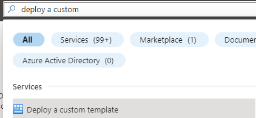
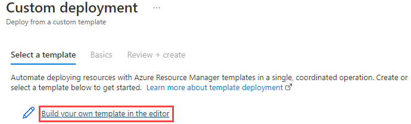
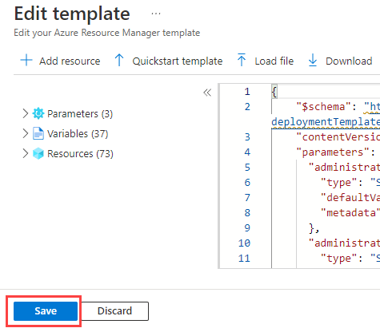

## Explore PostgreSQL Developer samples

### Development environment setup

The first step to exploring the evolution of PostgreSQL Application development is to get the environment set up and configure the infrastructure.

We provided two ARM templates that can be deployed that will set up the environment. The template is a JavaScript Object Notation (JSON) file that defines the infrastructure and configuration for a deployment. In the template, various resources and their properties are defined.

One is a **basic deployment** of services that are exposed to the internet and the other is a more secure environment that utilizes private endpoints and VNet integrations. It also includes items like Azure Firewall and other security-related configurations.

The basic template is the cheaper way to go and should work without any configuration. The **secure template** will have much higher costs and will require special configuration and changes to get the samples to work properly.

#### How to deploy a local ARM template

Below are two methods of deploying an ARM template:

**Azure Portal**

- Login into the Azure Portal and choose a valid Subscription.
- Search for 'Deploy a custom template'.

- Select 'Build your own template in the editor'.

- Load the ARM template file from the cloned repo directory.

- Navigate to the **template.json** file.
- Save the template.

- Enter the template parameters.
- Select the **Review + create** button.
- Check for validation errors. For example, it could be that the template resources exceed a quota for the target subscription and region.

Another option for deploying infrastructure using a template is to use Azure CLI or PowerShell. Here is a tutorial guide:

[Tutorial: Deploy a local ARM template](https://learn.microsoft.com/azure/azure-resource-manager/templates/deployment-tutorial-local-template?tabs=azure-cli)

#### Step 1 - Build the development environment - deploy one of the templates below

- [Basic Template](https://github.com/Azure/azure-PostgreSQL/tree/master/DeveloperGuide/step-0-create-development-vm/basic-template/template.json)
- [Secure Template](https://github.com/Azure/azure-PostgreSQL/tree/master/DeveloperGuide/step-0-create-development-vm/basic-template/template-secure.json)

Due to the number of software packages to be installed, the deployment of the template may fail due to a time out of the VM extension `winExtension` on the -win11 and -paw-1 virtual machines. On each of these virtual machines, the log for the installation of the software is located at `C:\WindowsAzure\Logs\CloudLabsCustomScriptExtension.txt` to follow the progress.

#### Step 2 - Explore the development environment

Once the template has been deployed, several resources will be deployed to support the developer journey. Not all of these will be used but are provided in case other paths would like to be explored.

As part of the deployment, a **pgsqldevSUFFIX-win11** virtual machine has been deployed that will be used to perform all the activities. Login to this virtual machine by doing the following:

- Open Azure Portal
- Browse to the resource group
- Select the **pgsqldevSUFFIX-win11** virtual machine
- Select **Connect->RDP**
- Select **Download RDP file**
- Open the downloaded file, select **Connect**
- For the username, type **wsuser**
- For the password, type **Solliance123**

Once in the virtual machine, notice that all the necessary development tools have already been installed. Additionally, the supporting GitHub repository has been downloaded which includes all the artifacts needed to start the developer journey. These files can be found on the **pgsqldevSUFFIX-win11** virtual machine in the `C:\labfiles\microsoft-postgresql-developer-samples` folder.

### Developer Samples

Additionally, some problems are solved by more than just a web application and a database backend. Microsoft Azure provides several compute engines with varying degrees of features and administrative abilities that have connectivity to Azure Database for PostgreSQL Flexible Server.

- [PostgreSQL Developer Features](samples/04-01-PostgreSQL-Developer-Features/README.md)
- [Azure Functions](https://learn.microsoft.com/azure/azure-functions/functions-overview)
  - [Dotnet](https://github.com/azure/azure-postgresql/tree/master/DeveloperGuide/step-2-developer-journey-steps/06-01-FunctionApp-DotNet)
  - [Python](https://github.com/azure/azure-postgresql/tree/master/DeveloperGuide/step-2-developer-journey-steps/06-02-FunctionApp-Python)
  - [AKS](https://github.com/azure/azure-postgresql/tree/master/DeveloperGuide/step-2-developer-journey-steps/06-03-FunctionApp-AKS)
  - [Secured with MSI](https://github.com/azure/azure-postgresql/tree/master/DeveloperGuide/step-2-developer-journey-steps/06-04-FunctionApp-MSI)
- [Logic Apps](https://github.com/azure/azure-postgresql/tree/master/DeveloperGuide/step-2-developer-journey-steps/06-05-LogicApp)
- [Azure Data Factory](https://github.com/azure/azure-postgresql/tree/master/DeveloperGuide/step-2-developer-journey-steps/07-01-AzureDataFactory)
- [Azure Synapse Analytics](https://github.com/azure/azure-postgresql/tree/master/DeveloperGuide/step-2-developer-journey-steps/07-02-AzureSynapseAnalytics)
- [Azure Batch](https://github.com/azure/azure-postgresql/tree/master/DeveloperGuide/step-2-developer-journey-steps/07-03-AzureBatch)
- [External Samples](samples/04-10_External_Samples/README.md)

### App Modernization

In addition to the samples above, it is also an option to take an in-depth journey through an Application Modernization series of samples. This is provided in the lab samples appendix.

- [Application Modernization](../10_02_AppModernization/10_02_AppModernization.md)
