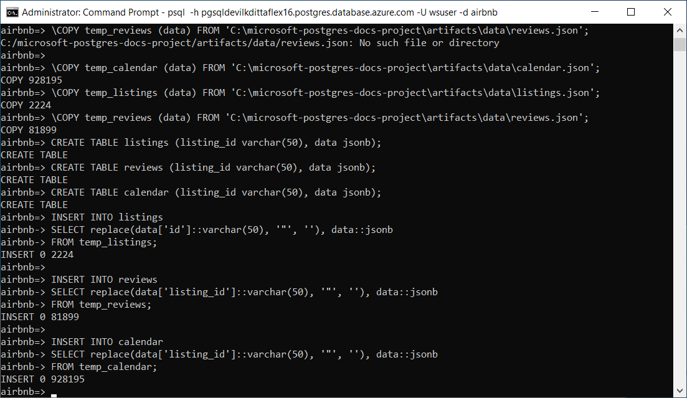
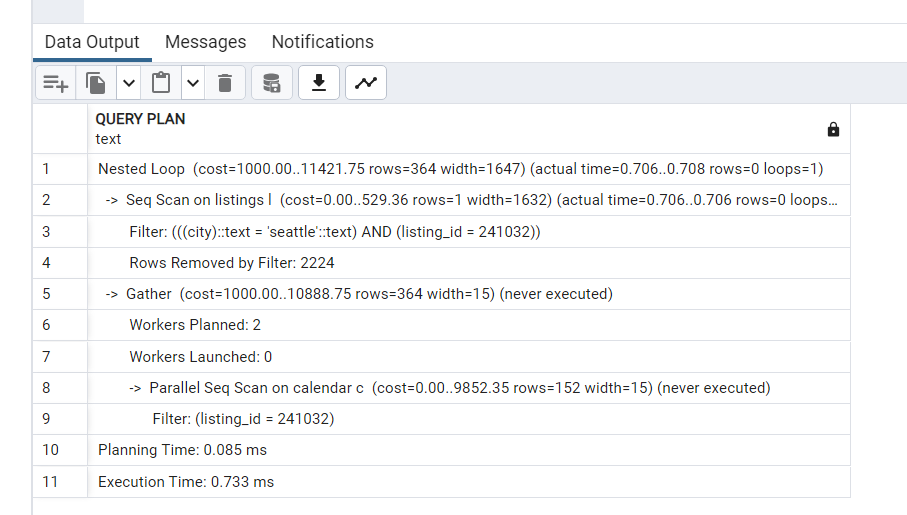
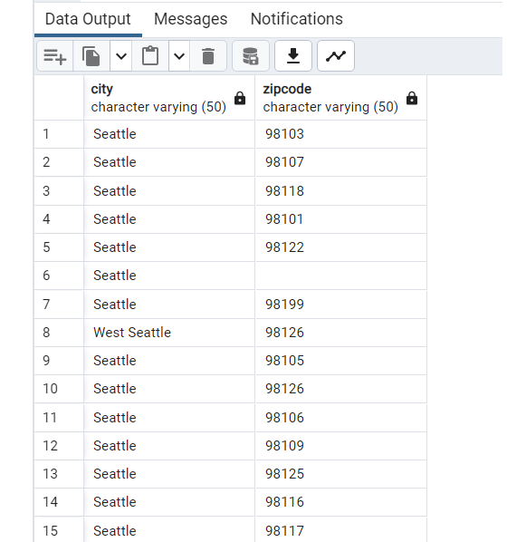
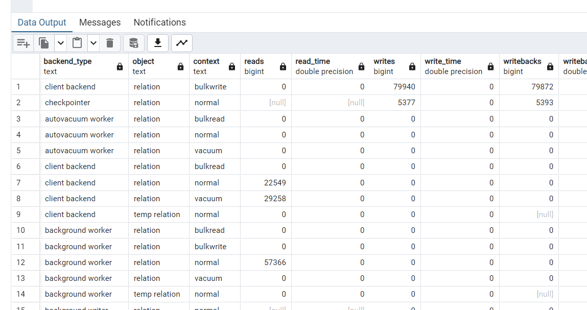

# Hands-on Lab: Working with the latest developer capabilities of Postgres 16

- [Hands-on Lab: Working with the latest developer capabilities of Postgres 16](#hands-on-lab-working-with-the-latest-developer-capabilities-of-postgres-16)
  - [Setup](#setup)
    - [Required Resources](#required-resources)
    - [Software pre-requisites](#software-pre-requisites)
  - [Exercise 1: Setup and Configuration](#exercise-1-setup-and-configuration)
    - [Task 1: Configure Server Parameters](#task-1-configure-server-parameters)
    - [Task 2: Create tables and data](#task-2-create-tables-and-data)
  - [Exercise 2: Developer Features](#exercise-2-developer-features)
    - [Task 1: Add SQL/JSON object checks](#task-1-add-sqljson-object-checks)
    - [Task 2: Exploring JSON\_ARRAY, JSON\_ARRAYAGG and JSON\_OBJECT](#task-2-exploring-json_array-json_arrayagg-and-json_object)
    - [Task 3: Creating Indexes](#task-3-creating-indexes)
    - [Task 4: Using Full Text + GIN indexes](#task-4-using-full-text--gin-indexes)
    - [Task 5: Aggregate function ANY\_VALUE()](#task-5-aggregate-function-any_value)
  - [Exercise 3: COPY Features](#exercise-3-copy-features)
    - [Task 1: Allow a COPY FROM value to map to a column's DEFAULT](#task-1-allow-a-copy-from-value-to-map-to-a-columns-default)
  - [Exercise 4: Performance Features](#exercise-4-performance-features)
    - [Task 1: Allow parallelization of FULL and internal RIGHT OUTER hash joins](#task-1-allow-parallelization-of-full-and-internal-right-outer-hash-joins)
    - [Task 2: Allow aggregate functions string\_agg() and array\_agg() to be parallelized](#task-2-allow-aggregate-functions-string_agg-and-array_agg-to-be-parallelized)
    - [Task 3: Add EXPLAIN option GENERIC\_PLAN to display the generic plan for a parameterized query](#task-3-add-explain-option-generic_plan-to-display-the-generic-plan-for-a-parameterized-query)
    - [Task 4: Using pg\_stat\_io for enhanced IO monitoring](#task-4-using-pg_stat_io-for-enhanced-io-monitoring)
  - [Exercise 5: Other Features (Optional)](#exercise-5-other-features-optional)
    - [Task 1: Use new VACUUM options to improve VACUUM performance](#task-1-use-new-vacuum-options-to-improve-vacuum-performance)

In this lab, several new developer and infrastructure features of PostgreSQL 16 will be explored.

## Setup

### Required Resources

Several resources are required to perform this lab. These include:

- Azure Database for PostgreSQL Flexible Server (Version 14)
- Azure Database for PostgreSQL Flexible Server (Version 16)

Create these resources using the PostgreSQL Flexible Server Developer Guide Setup documentation:

- [Deployment Instructions](../../../11_03_Setup/00_Template_Deployment_Instructions.md)

### Software pre-requisites

All this is done already in the lab setup scripts for the Lab virtual machine but is provided here for reference.

- Install [pgAdmin](https://www.pgadmin.org/download/)

## Exercise 1: Setup and Configuration

In this exercise, some tables will be created and the COPY command will be used to move data into those tables.  The data is in JSON format and not SQL format so the usage of `jsonb` data type with be required to import the data into a temporary table.  We will use this initial data to run some queries to transform the data such that we can utilize the new JSON syntax in PostgreSQL 16.

### Task 1: Configure Server Parameters

In this task, server parameters will be configured to ensure support for the Query Store and logical replication in subsequent labs. It is necessary to enable Query Store now as it takes a few minutes for the queries to start to be recorded.

1. Switch to the Azure Portal.
2. Browse to the primary **pgsqldevSUFFIXflex16** instance or writer endpoint.
3. Under **Settings**, select **Server parameters**.
4. Browse for the `wal_level` parameters.
5. Set the value to `logical`.
6. Select **Save**.
7. Select **Save & Restart**.
8. **Repeat the same steps** for any replicas and the **pgsqldevSUFFIXflex14** instance.

### Task 2: Create tables and data

1. In the Windows-based lab virtual machine (**pgsqldevSUFFIX-win11**), open a command prompt window, in the Windows search area, type **cmd** and select it.

    

2. Run the following command to connect to the database, be sure to replace `PREFIX` and `REGION` with the lab information (optionally use pgAdmin to open a `psql` window). On Windows, find the `pgbench` tool in the `C:\Program Files\PostgreSQL\16\bin` directory, on Ubuntu, install it using `sudo apt-get install postgresql-contrib`.  When prompted, enter the password (`Solliance123`):

    ```cmd
    psql -h pgsqldevSUFFIXflex16.postgres.database.azure.com -U wsuser -d airbnb
    ```

    > NOTE: If you get an error when connecting, ensure that your client machine IP Address has been allowed access.

3. Run the following commands to create some temp tables and import the JSON and CSV data to the server.  Notice the usage of `json` files to do the import using the `COPY` command. Once into a temporary table, we then do some massaging:

    > NOTE: These paths are Windows based and may need to be adjusted based on the environment (WSL, Linux, etc).

    ```sql
    DROP TABLE IF EXISTS temp_calendar;
    DROP TABLE IF EXISTS temp_listings;
    DROP TABLE IF EXISTS temp_reviews;
    
    CREATE TABLE temp_calendar (data jsonb);
    CREATE TABLE temp_listings (data jsonb);
    CREATE TABLE temp_reviews (data jsonb);
    ```

4. Now, use the `COPY` command to populate the tables with data from JSON files in a public storage account.

    ```sql
    \COPY temp_calendar (data) FROM PROGRAM 'curl https://solliancepublicdata.blob.core.windows.net/ms-postgresql-labs/calendar.json'
    ```

    ```sql
    \COPY temp_listings (data) FROM PROGRAM 'curl https://solliancepublicdata.blob.core.windows.net/ms-postgresql-labs/listings.json'
    ```

    ```sql
    \COPY temp_reviews (data) FROM PROGRAM 'curl https://solliancepublicdata.blob.core.windows.net/ms-postgresql-labs/reviews.json'
    ```

    

5. Run the following command to create the main tables:

    ```sql
    DROP TABLE IF EXISTS listings;
    DROP TABLE IF EXISTS reviews;
    DROP TABLE IF EXISTS calendar;

    CREATE TABLE listings (
        listing_id int,
        name varchar(50),
        street varchar(50),
        city varchar(50),
        state varchar(50),
        country varchar(50),
        zipcode varchar(50),
        bathrooms int,
        bedrooms int,
        latitude decimal(10,5), 
        longitude decimal(10,5), 
        summary varchar(2000),
        description varchar(2000),
        host_id varchar(2000),
        host_url varchar(2000),
        listing_url varchar(2000),
        room_type varchar(2000),
        amenities jsonb,
        host_verifications jsonb,
        data jsonb
    );

    CREATE TABLE reviews (
        id int, 
        listing_id int, 
        reviewer_id int, 
        reviewer_name varchar(50), 
        date date,
        comments varchar(2000)
    );

    CREATE TABLE calendar (
        listing_id int, 
        date date,
        price decimal(10,2), 
        available boolean
    );
    ```

6. Run the following to import the data from the temp tables to the main tables:

    ```sql
    INSERT INTO listings
    SELECT 
        data['id']::int, 
        replace(data['name']::varchar(50), '"', ''),
        replace(data['street']::varchar(50), '"', ''),
        replace(data['city']::varchar(50), '"', ''),
        replace(data['state']::varchar(50), '"', ''),
        replace(data['country']::varchar(50), '"', ''),
        replace(data['zipcode']::varchar(50), '"', ''),
        data['bathrooms']::int,
        data['bedrooms']::int,
        data['latitude']::decimal(10,5),
        data['longitude']::decimal(10,5),
        replace(data['description']::varchar(2000), '"', ''),        
        replace(data['summary']::varchar(2000), '"', ''),        
        replace(data['host_id']::varchar(50), '"', ''),
        replace(data['host_url']::varchar(50), '"', ''),
        replace(data['listing_url']::varchar(50), '"', ''),
        replace(data['room_type']::varchar(50), '"', ''),
        data['amenities']::jsonb,
        data['host_verifications']::jsonb,
        data::jsonb
    FROM temp_listings;
    
    INSERT INTO reviews
    SELECT 
        data['id']::int,
        data['listing_id']::int,
        data['reviewer_id']::int,
        replace(data['reviewer_name']::varchar(50), '"', ''), 
        to_date(replace(data['date']::varchar(50), '"', ''), 'YYYY-MM-DD'),
        replace(data['comments']::varchar(2000), '"', '')
    FROM temp_reviews;
    
    INSERT INTO calendar
    SELECT 
        data['listing_id']::int,
        to_date(replace(data['date']::varchar(50), '"', ''), 'YYYY-MM-DD'),
        data['price']::decimal(10,2),
        replace(data['available']::varchar(50), '"', '')::boolean
    FROM temp_calendar;
    ```

    

    > NOTE: We are storing data in the tables as JSONB for lab purposes.  In the real world, it may not be appropriate. With normal columns, PostgreSQL maintains statistics about the distributions of values in each column of the table – most common values (MCV), NULL entries, histogram of distribution. Based on this data, the PostgreSQL query planner makes smart decisions on the plan to use for the query. At this point, PostgreSQL does not store any stats for JSONB columns or keys. This can sometimes result in poor choices like using nested loop joins vs. hash joins.

7. Open `pgAdmin`
8. Right-click the **Servers** node, then select **Register->Server**.
  
    

9. For name, type **PREFIX-pg-flex-REGION-16**, and be sure to replace `PREFIX` with the lab information.
10. Select the **Connection** tab.
11. For the **host name/address**, paste the server name copied from above.
12. For the username, type **s2admin**.
13. For the password, type **Seattle123Seattle123**.
14. Select **Save password?** to toggle it on.
15. Select **Save**.
16. Again, repeat for the **PREFIX-pg-flex-REGION-14** instance.
17. Navigate to **Databases->airbnb->Schemas->public->Tables**.
18. Right-click the **Tables** node, then select **Query Tool**.

    

19. Run each of the following commands to see the imported data after its transformation.  Note that we did not fully expand the JSON into all possible columns so as to show the new JSON syntax later:

    ```sql
    select * from listings limit 10;
    select * from reviews limit 10;
    select * from calendar limit 10;
    ```

    

    

    

## Exercise 2: Developer Features

There are several developer-based changes in PostgreSQL 16 as related to SQL syntax. In this exercise, we explore several of them including the new SQL standard JSON functions.

- [Function Json](https://www.postgresql.org/docs/16/functions-json.html)

### Task 1: Add SQL/JSON object checks

1. In pgAdmin, run the following pre-16 commands. The use of `->` and `->>` are pre-Postgres 14 commands used to navigate a json hierarchy:

    ```sql
    SELECT
       listing_id,
       pg_typeof(data),
       pg_typeof(data ->> 'id')
    FROM
       listings LIMIT 1;
    ```

    

2. The same query can also be written in Postgres 14 and higher, note the usage of the bracket notation `[]` and the result is slightly different:

    ```sql
    SELECT
       listing_id,
       pg_typeof(data),
       pg_typeof(data['id'])
    FROM
       listings LIMIT 1;
    ```

    

3. In Postgres 16, it is now possible to use the SQL standard `IS JSON` syntax.  The `IS JSON` checks include checks for values, arrays, objects, scalars, and unique keys:

    ```sql
    SELECT
       listing_id,
       data IS JSON,
       data['id'] IS JSON
    FROM
       listings LIMIT 1;
    ```

    

4. Additionally, new functions allow for queries to be more granular about the type of JSON.

    ```sql
    SELECT
    	data -> 'amenities' IS JSON ARRAY as amenities,
    	data -> 'host_verifications' IS JSON OBJECT as host_verifications,
    	data IS JSON as datacolumn,
    	data -> 'id' IS JSON SCALAR as id
    FROM
    	listings;
    ```

    

5. When combining the above, it is possible to create intricate `CASE` statements based on the target type (if it could be multiple types):

    ```sql
    SELECT
       CASE
        WHEN
            data -> 'street' IS JSON ARRAY
        THEN
            (data -> 'street')[0]
        WHEN
            data -> 'street' IS JSON OBJECT
        THEN
            data -> 'street'
        WHEN
            data IS JSON SCALAR
        THEN
            data
        ELSE
            data -> 'street'
       END
       AS primary_address
    FROM
       listings;
    ```

    

6. Finally, much of the basic JSON functionality that has existed pre-PG16 is still available and can also be used.  In this example, the containment operator is used (where one json document is contained inside another) to select data in addition to using the backward-compatible JSON syntax.  Note the usage of the ["?" operator](https://www.postgresql.org/docs/9.5/functions-json.html) that tests the existence of the top-level key for the `host_is_superhost`:

    ```sql
    SELECT listing_id, name as listing_name, city, listings.amenities
    FROM listings
    WHERE
    listings.amenities @> '["Washer","Pets Allowed"]'
    and data -> 'host_is_superhost' ? 't';
    ```

    

### Task 2: Exploring JSON_ARRAY, JSON_ARRAYAGG and JSON_OBJECT

In this series of steps, the new functions `JSON_ARRAY()`, `JSON_ARRAYAGG()`, and `JSON_OBJECT()` that are part of the SQL standard and now PostgreSQL 16 will be reviewed.

1. In pgAdmin, run the following PostgreSQL 16 commands:

    ```sql
    SELECT
       json_array(data['id'], name, bedrooms, city, state)
    FROM
       listings;
    ```

    

    ```sql
    SELECT
        json_arrayagg(data['id'])
    FROM
        listings;
    ```

    

2. It is also possible to convert regular types into JSON using the `JSON_OBJECT` function.  The following will take several data types and create a JSON object from them:

    ```sql
    SELECT json_object(ARRAY[1, 'a', true, row(2, 'b', false)]::TEXT[]);
    ```

    

3. Additionally, use the `json_agg` combined with `row_to_json` to convert a series of columns in a select statement into json:

    ```sql
    select 
    	bedrooms,
    	json_agg(row_to_json((name, street))) as jData
	from 
        listings
	group by 
        bedrooms
    ```

    

There are many other types of functions and operators in PostgreSQL that can be utilized when working with JSON data. Reference the latest information for PG16 in the [9.16. JSON Functions and Operators](https://www.postgresql.org/docs/16/functions-json.html) documentation.

### Task 3: Creating Indexes

Indexes help increase query performance.  

1. Run the following query, notice the usage of a `Seq Scan` on the table, also record the costs and execution time:

    ```sql
        EXPLAIN ANALYZE select *
        from listings l, calendar c
        where l.city = 'seattle'
        and l.listing_id = c.listing_id
        and l.listing_id = 241032
    ```

    

2. Create an index on the `listing_id`` column:

    ```sql
    CREATE INDEX listings_listing_id ON listings (listing_id);
    ```

3. Re-run the query to see the `Sequential Scan` is now removed and a `Index Scan` is now used to improve the cost and execution times:

    ```sql
        EXPLAIN ANALYZE select *
        from listings l, calendar c
        where l.city = 'seattle'
        and l.listing_id = c.listing_id
        and l.listing_id = 241032
    ```

    

### Task 4: Using Full Text + GIN indexes

Although indexes on JSON data are not new to PG16 (available since 8.2 with JSON support since 9.2), it is a valuable feature to be aware of when working with PostgreSQL and JSON. GIN indexes can be used to efficiently search for keys or key/value pairs occurring within a large number of jsonb documents (datums). Two GIN "operator classes" are provided, offering different performance and flexibility trade-offs.  

For information on Full Text Search, reference [Full Text Search](https://www.postgresql.org/docs/current/textsearch.html).  For information on GiST and GIN indexes, reference [GiST and GIN Index Types.](https://www.postgresql.org/docs/9.1/textsearch-indexes.html)

1. Run the following query:

    ```sql
    ALTER TABLE listings 
    ADD COLUMN ts_summary tsvector
    GENERATED ALWAYS AS (to_tsvector('english', summary)) STORED;
    ```

2. Do a text search, and note the use of a `Seq Scan`:

    ```sql
    EXPLAIN ANALYZE SELECT *
    FROM listings
    WHERE ts_summary @@ to_tsquery('amazing');
    ```

    

3. In pgAdmin, run the following command:

    ```sql
    CREATE INDEX ts_idx ON listings USING GIN (ts_summary);
    ```

4. Again, re-run the query, and notice the usage of a `Bitmap Heap Scan` instead of a `Seq Scan`:

    ```sql
    EXPLAIN ANALYZE SELECT *
    FROM listings
    WHERE ts_summary @@ to_tsquery('amazing');
    ```

    

### Task 5: Aggregate function ANY_VALUE()

The `ANY_VALUE()` function is a PostgreSQL aggregate function that helps optimize queries when utilizing GROUP BY clauses. The function will return an arbitrary non-null value in a given set of values. It effectively informs PostgreSQL that any value from the group is acceptable, resolving the ambiguity and allowing the query to execute successfully.

Prior to PostgreSQL 16, when using GROUP BY, all non-aggregated columns from the SELECT statement were included in the GROUP BY clause as well. Pre-16 PostgreSQL would throw an error if a non-aggregated column is not added in the GROUP BY clause.

1. The following is an example of pre-16 syntax (**will throw error**):

    ```sql
    SELECT 
        l.city,
        l.zipcode as SampleZipCode
        count(*) as ListingCount
    FROM 
        listings l
    GROUP 
        BY l.city;
    ```

    

2. Modify the query to utilize the new `ANY_VALUE` function:

    ```sql
    SELECT 
        l.city,
        ANY_VALUE(l.zipcode) as SampleZipCode,
        count(*) as ListingCount
    FROM 
        listings l
    GROUP 
        BY l.city;
    ```

    

3. Keep in mind that the `ANY_VALUE` is the selection of a non-null item from the group, and does not act the same with the full `group by` clause:

    ```sql
    select
        l.city,
        l.zipcode
    from 
        listings l
    group 
        by l.city, l.zipcode;
    ```

    

## Exercise 3: COPY Features

### Task 1: Allow a COPY FROM value to map to a column's DEFAULT

The new `COPY FROM` `DEFAULT` parameter syntax allows for the import of data into a table using a common token in the source data.

> NOTE: These paths below are Windows based and may need to be adjusted based on the environment (WSL, Linux, etc)

1. Using a web browser, download and review the `https://solliancepublicdata.blob.core.windows.net/ms-postgresql-labs/default.csv` file
2. Notice the usage of the `\D` in the source data:

    

3. In pgAdmin, right-click the `airbnb` database, then select **PSQL Tool**.
4. In the `psql` window, run the following command to import the data:

    ```sql
    CREATE TABLE default_test(c1 INT PRIMARY KEY, c2 TEXT DEFAULT 'the_default_value') ;
    
    \COPY default_test FROM PROGRAM 'curl https://solliancepublicdata.blob.core.windows.net/ms-postgresql-labs/default.csv' WITH (format csv, default '\D', header);
    ```

5. Run the following command to review the results of the `COPY FROM` command:

    ```cmd
    SELECT
        *
    FROM
        default_test;
    ```

    

Notice every entry from the source file with the default of '\D' was converted to the `DEFAULT` value from the column definition.

## Exercise 4: Performance Features

### Task 1: Allow parallelization of FULL and internal RIGHT OUTER hash joins

In general, the more things that can be done in parallel the faster the results.  As is the case when performing `FULL` and internal `RIGHT OUTER` joins.  Previous to PostgreSQL these would not have been executed in parallel and the costs were more to perform than the parallelization setup.

With this change, many queries performed using these joins will now run faster in PG16.

1. Switch to pgAdmin.
2. Run the following commands to set up some sample tables and data on the PG16 instance.

    ```sql
    DROP TABLE IF EXISTS left_table;
    DROP TABLE IF EXISTS right_table;
    
    create table left_table (x int, y int);
    create table right_table (x int, y int);
    
    insert into left_table
    select (case x % 4 when 1 then null else x end), x % 10
    from generate_series(1,3000000) x;
    
    insert into right_table
    select (case x % 4 when 1 then null else x end), x % 10
    from generate_series(1,3000000) x;
    ```

3. Ensure that the instance is enabled and configured for parallel hash joins, this is the default for instances, but depending is always worth verifying.  Notice the following default values.
   - parallel_type_cost = `0.1`
   - parallel_setup_cost = `1000`
   - max_parallel_workers_per_gather = `2`
   - enable_parallel_hash = `on`

    ```sql
    show parallel_tuple_cost;
    show parallel_setup_cost;
    show max_parallel_workers_per_gather;
    show enable_parallel_hash;
    ```

    > NOTE: If the table values are very small, the effort of doing a parallel operation may be more than the effort to do a non-parallel execution.  The tables and rows above should be enough to generate a Parallel Hash Full Join plan.

4. Run the following command to see the execution plan of the select statement, note that we are disabling the calculation of costs to ensure that the parallel hash full join is displayed in the execution plan.  This is because the costs to do parallel for this query may be higher than simply doing a regular hash full join:

    ```sql
    EXPLAIN (costs off)
    SELECT count(*)
    FROM left_table lt
    FULL OUTER JOIN right_table rt
    ON lt.x = rt.x;
    ```

5. In the execution plan, notice the use of a `Parallel Hash Full Join`.  

    

6. In previous versions of PostgreSQL, a regular `Hash Full Join` would display.

    

Full JOINs are commonly used to find the differences between 2 tables. Prior to Postgres 16, parallelism was not implemented for full hash JOINs, which made them slower to execute. [(link to commit)](https://github.com/postgres/postgres/commit/11c2d6fdf)

### Task 2: Allow aggregate functions string_agg() and array_agg() to be parallelized

Aggregate functions typically perform some kind of mathematical operation on a column or set of columns.  When calculating several aggregates at once, it is easy to imagine that doing each one in a serialized manner would likely take much longer than doing it in a parallel manner.

Not all aggregate functions have supported this type of optimization, as with the `string_agg()` and `array_agg()` functions.  In PostgreSQL 16, this support was added and per the description on the code commit "adds combine, serial and deserial functions for the array_agg() and string_agg() aggregate functions, thus allowing these aggregates to partake in partial aggregations.  This allows both parallel aggregation to take place when these aggregates are present and also allows additional partition-wise aggregation plan shapes to include plans that require additional aggregation once the partially aggregated results from the partitions have been combined."

The following is an example of a query that performs aggregates with the two functions included.  If this were to run on a pre-16 version, the query would be much slower than in version 16.

1. In pgAdmin, run the following:

    ```sql
    drop table if exists agg_test;

    create table agg_test (x int, y int);
    
    insert into agg_test
    select (case x % 4 when 1 then null else x end), x % 10
    from generate_series(1,500000) x;
    ```

2. Run a select statement against it to review the data generated:

    ```sql
    SELECT
        y,
        string_agg(x::text, ',') AS t,
        string_agg(x::text::bytea, ',') AS b,
        array_agg(x) AS a,
        array_agg(ARRAY[x]) AS aa
    FROM
        agg_test
    GROUP BY
        y;
    ```

    

3. Review the `EXPLAIN` plan details, notice the `HashAggregate` plan and the costs:

    ```sql
    EXPLAIN SELECT
        y,
        string_agg(x::text, ',') AS t,
        string_agg(x::text::bytea, ',') AS b,
        array_agg(x) AS a,
        array_agg(ARRAY[x]) AS aa
    FROM
        agg_test
    GROUP BY
        y;
    ```

4. In 16+, notice the use of a `Finalize GroupAggregate`:

    

5. In pre-16 instances, a `HashAggregate` would display (feel free to test on the PG14 instance):

    

For a more in-depth look at the code change for this feature, reference [here](https://git.postgresql.org/gitweb/?p=postgresql.git;a=commitdiff;h=16fd03e956540d1b47b743f6a84f37c54ac93dd4).

### Task 3: Add EXPLAIN option GENERIC_PLAN to display the generic plan for a parameterized query

Previously, attempting to get an execution plan for a parameterized query was fairly complicated.  For example, using a prepared statement will have several executions which may require the execution of all the sub-executions separately and then put the results together. Using the new PG16 feature will eliminate those extra steps when attempting to find performance issues with parameterized queries.

1. Run the following command to attempt to get an execution plan for a parameterized query using the pre-16 method:

    ```sql
    EXPLAIN SELECT * FROM listings WHERE listing_id = $1;
    ```

2. An error should be displayed.

    

3. To get an execution plan for a parametrized query, run the following:

    ```sql
    EXPLAIN (GENERIC_PLAN) SELECT * FROM listings WHERE listing_id = $1;
    ```

    

    > Note the use of the parenthesis.  The old way (shown above) was to not utilize parenthesis and is only for backwards compatibility. Newer options such as `GENERIC_PLAN` will only work with the new syntax.

As displayed above, it is possible to use parameter placeholders like `$1` instead of an unknown or variable value. However, there are certain restrictions:

- Use parameters only with the statements SELECT, INSERT, UPDATE, DELETE and VALUES.
- Only use parameters instead of constants (literals). It is not possible to use parameters instead of identifiers (object names) or keywords, among other things.

### Task 4: Using pg_stat_io for enhanced IO monitoring

`pg_stat_io` is a new catalog view that displays statistics around `reads` and `writes` and as of Postgres 16, `extends` information.

Per the [postgresql documentation](https://www.postgresql.org/docs/devel/monitoring-stats.html#MONITORING-PG-STAT-IO-VIEW) : "The pg_stat_io view will contain one row for each combination of backend type, target I/O object, and I/O context, showing cluster-wide I/O statistics. Combinations that do not make sense are omitted.

Currently, I/O on relations (e.g. tables, indexes) is tracked. However, relation I/O which bypasses shared buffers (e.g. when moving a table from one tablespace to another) is currently not tracked."

1. Run the following command to clear the stats and see the information available, notice all zeros:

    ```sql
    select pg_stat_reset_shared('io');

    select * from pg_stat_io order by writes desc;
    ```

    

2. `pgbench` can be used to generate IO data (~750MB of data). In the Windows-based lab virtual machine (**pgsqldevSUFFIX-win11**), open a command prompt window, in the Windows search area, type **cmd** and select it.
3. Run the following command. Be sure to replace the `PREFIX` and `REGION` tokens. On Windows, find the pgbench tool in the `C:\Program Files\PostgreSQL\16\bin` directory, on Ubuntu, install it using `sudo apt-get install postgresql-contrib`. When prompted, enter the `Solliance123` password:

    ```sql
    pgbench -i -s 50 -h pgsqldevSUFFIXflex16.postgres.database.azure.com -p 5432 -U wsuser -d airbnb
    ```

    > NOTE: In Azure Cloud Shell, check the version to ensure it is compatable with the target version (`pgbench --version`)

4. Again, run the previous command to see the newly generated IO information.

    ```sql
    --see client backed / bulk write in context after pgbench
    select * 
    from pg_stat_io 
    order by writes desc;
    ```

5. Notice the backend_type `client_backend` values changed to be much higher:

    

6. `pg_stat_io` will also break apart the operations into more granular statistics via the `context` column.  The `pgbench` test above generated context values in the `vacuum` and `bulkwrite` context categories.  When using basic DDL commands, the values will go into different context categories.

7. Run the following command to create some more test data using basic DDL `INSERT`:

    ```sql
    insert into agg_test
    select (case x % 4 when 1 then null else x end), x % 10
    from generate_series(1,200000) x;

    checkpoint;
    ```

8. Again, run the previous command to see the newly generated IO information.

    ```sql
    select * from pg_stat_io 
    order by writes desc;
    ```

9. Review the backendtype of `client_backend`, object of `relation`, context of `normal` and the `extends` column value.  Because it added data to an existing table, `extends` operations were performed.

Some common uses for this data include:

- Review if high evictions are occurring.  If so, shared buffers should be increased.
- Large number of fsyncs by client backends could indicate misconfiguration of the shared buffers and/or the checkpointer.

## Exercise 5: Other Features (Optional)

### Task 1: Use new VACUUM options to improve VACUUM performance

The PostgreSQL `VACUUM` command is used to garbage-collect and analyze databases.  It works by removing `dead` tuples left over by large changes to a database (such as frequently updated tables). By removing the gaps between the data, the performance of specific operations will increase and available disk space should go up.

One of the new features of `VACUUM` in Postgres 16 is the ability to update the cost limit on the fly.  This will allow people who run large production databases that may be running out of disk space a bit too quickly; which if to occur, would likely take down the production system. to get VACUUM to execute faster. During a `VACUUM` it could be that it is not running as fast as it needs to because of the cost limit.

By allowing the change during the operation, the `VACUUM` operation can be sped up without restarting it.

These server parameters are called `vacuum_cost*` or `auto_vacuum_vacuum_cost*`. The default for the `vacuum_cost_limit` is `200` and `auto_vacuum_vacuum_cost` is `-1` which indicates to use of the default vacuum cost limit.

Perform the following steps to see how this could potentially work:

1. Execute the following to start a vacuum operation:

    ```sql
    vacuum analyze;
    ```

2. While the operation is executing, run the following command to increase the cost limits.  Note that in pre-16 versions, this command would not affect currently running operations, in 16, this action applies during the execution:

    ```sql
    SET vacuum_cost_limit TO 400;
    ```

    > NOTE: These can also be set in the Azure Portal.

3. Use the following command to monitor the vacuum operations:

    ```sql
    select schemaname,relname,n_dead_tup,n_live_tup,round(n_dead_tup::float/n_live_tup::float*100) dead_pct,autovacuum_count,last_vacuum,last_autovacuum,last_autoanalyze,last_analyze from pg_stat_all_tables where n_live_tup >0;
    ```

For more information on Azure Database for PostgreSQL Flexible Server autovacuum features read [Autovacuum Tuning in Azure Database for PostgreSQL - Flexible Server](https://learn.microsoft.com/azure/postgresql/flexible-server/how-to-autovacuum-tuning).

For a more in-depth look at the code change for this feature, reference [here](https://git.postgresql.org/gitweb/?p=postgresql.git;a=commitdiff;h=7d71d3dd080b9b147402db3365fe498f74704231).
