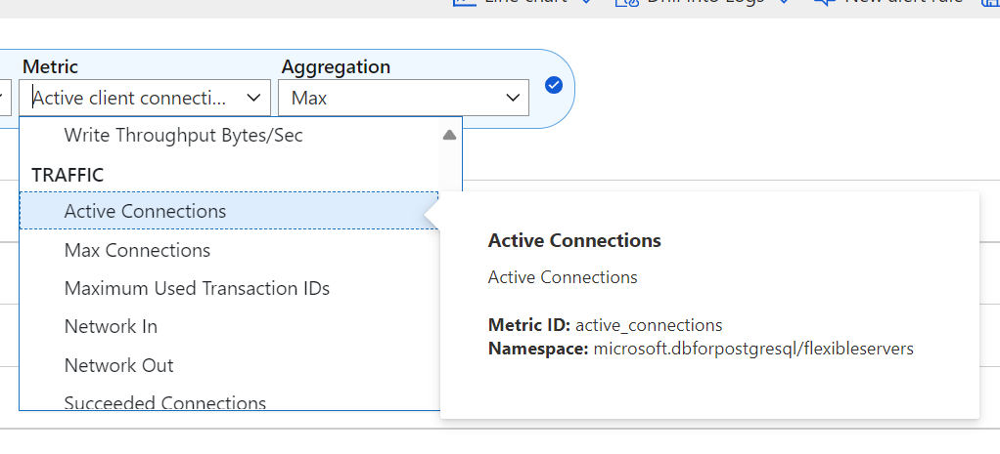
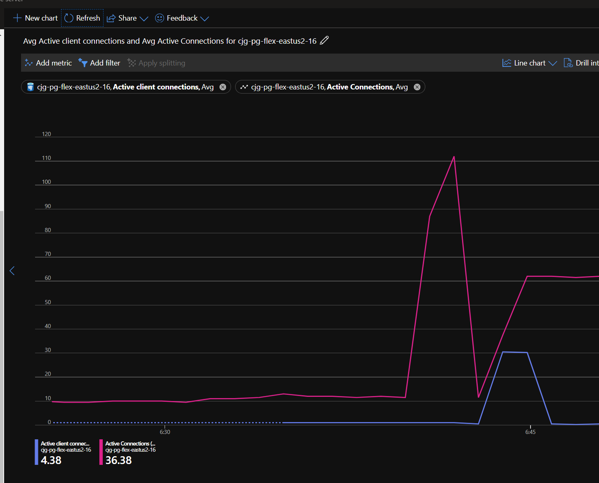

# Hands-on Lab: Working with PgBouncer

- [Hands-on Lab: Working with PgBouncer](#hands-on-lab-working-with-pgbouncer)
  - [Setup](#setup)
    - [Required Resources](#required-resources)
    - [Software pre-requisites](#software-pre-requisites)
  - [Exercise 1: PgBouncer](#exercise-1-pgbouncer)
    - [Task 1: Enable PgBouncer and PgBouncer Metrics](#task-1-enable-pgbouncer-and-pgbouncer-metrics)
    - [Task 2: Performance without PgBouncer](#task-2-performance-without-pgbouncer)
    - [Task 3: Performance with PgBouncer](#task-3-performance-with-pgbouncer)

In this lab, PgBouncer will be configured and tested.

## Setup

### Required Resources

Several resources are required to perform this lab. These include:

- Azure Database for PostgreSQL Flexible Server (Version 16)

Create these resources using the PostgreSQL Flexible Server Developer Guide Setup documentation:

- [Deployment Instructions](../../../11_03_Setup/00_Template_Deployment_Instructions.md)

### Software pre-requisites

All this is done already in the lab setup scripts for the Lab virtual machine but is provided here for reference.

- None

## Exercise 1: PgBouncer

PgBouncer is a well-known and supported 3rd party open-source, community-developed project. PgBouncer is commonly used to reduce resource overhead by managing a pool of connections to PostgreSQL, making it ideal for environments with high concurrency and frequent short-lived connections. It enables optimization by reducing the load on PostgreSQL server caused by too many connections.

References:

- <https://learn.microsoft.com/azure/postgresql/flexible-server/concepts-pgbouncer>

### Task 1: Enable PgBouncer and PgBouncer Metrics

PgBouncer metrics can be used to monitor the performance of the PgBouncer process, including details for active connections, idle connections, total pooled connections, and the number of connection pools. Each metric is emitted at a 1-minute interval and has up to 93 days of history. Customers can configure alerts on the metrics and also access the new metrics dimensions to split and filter metrics data by database name. PgBouncer metrics are disabled by default. For PgBouncer metrics to work, both the server parameters `pgbouncer.enabled` and metrics.pgbouncer_diagnostics must be enabled. These parameters are dynamic and don't require an instance restart.

- Browse to the Azure Portal and the **pgsqldevSUFFIXflex16** resource.
- Under **Settings**, select **Server parameters**.
- Search for the `pgbouncer.enabled` dynamic parameters.
- Toggle the setting to `TRUE`.

    

- Search for the `metrics.pgbouncer_diagnostics` dynamic parameters.
- Toggle the setting to `ON`.
- Select **Save**.

### Task 2: Performance without PgBouncer

1. Switch to the Azure Portal.
2. Browse to the `pgsqldevSUFFIXflex16.postgres.database.azure.com` instance.
3. Under **Monitoring** select **Metrics**.

    

4. For the **Metric**, under the **TRAFFIC** category, select **Active connections**.

    

5. Select **Add metric**.
6. Under the **PGBOUNCER** category, select **Active client connections**.
7. In the top right, select the time to **Last 30** minutes** then select **Apply**.

    

8. In the Windows-based lab virtual machine (**pgsqldevSUFFIX-win11**), open a command prompt window, in the Windows search area, type **cmd** and select it.
9. Run the following commands to execute a `pgbench` test directly against the database server, when prompted enter the password `Solliance123`.  Notice the use of the `-c` parameter that will create 100 different connections, be sure to replace `PREFIX` with the lab information. On Windows, find the pgbench tool in the `C:\Program Files\PostgreSQL\16\bin` directory, on Ubuntu, install it using `sudo apt-get install postgresql-contrib`::

    ```sql
    pgbench -c 100 -T 180 -h pgsqldevSUFFIXflex16.postgres.database.azure.com -p 5432 -U wsuser -d airbnb
    ```

10. Switch back to the Metrics window, and after a minute, notice the `active connections` increase.

    

11. Stop the test or wait for it to finish.

### Task 3: Performance with PgBouncer

1. Switch back to the Windows command prompt.
2. Run the following commands to execute a `pgbench` test against the PgBouncer instance, when prompted enter the password `Solliance123`. Notice the change of the port to the PgBouncer port of `6432`, be sure to replace `PREFIX` and `REGION` with the lab information:

    ```sql
    pgbench -c 100 -T 180 -h pgsqldevSUFFIXflex16.postgres.database.azure.com -p 6432 -U wsuser -d airbnb
    ```

3. Switch back to the metrics window.  After a minute, the server `active connections` will max out and the PgBouncer `active client connections` will increase to handle the load on behalf of the server.

    
