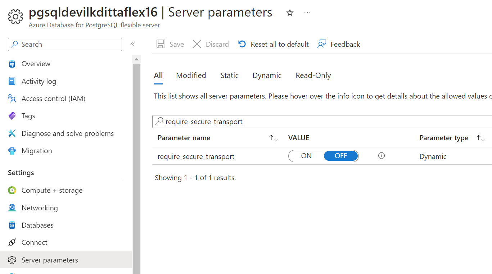

# Hands-on Lab: Logic Apps with PostgreSQL

Logic Apps can be used to connect to Azure Database for PostgreSQL Flexible Server instances and perform actions such as SELECT, INSERT, DELETE and UPDATE. However, Logic Apps do not have any direct integrations that allow for triggers that fire from PostgreSQL DDL or DML events. For the PostgreSQL actions to connect to the PostgreSQL instance, it is necessary to install a Logic Apps Gateway. This can be done with Azure instances, but the Azure Database for PostgreSQL Flexible Server will need private endpoints enabled and the gateway will need to run in a virtual machine that can access that private endpoint.

## Setup

### Required Resources

Several resources are required to perform this lab. These include:

- Local install of Azure Database for PostgreSQL Flexible Server
- Virtual Networks
- Logic App

Create these resources using the PostgreSQL Flexible Server Developer Guide Setup documentation:

- [Deployment Instructions](../../../11_03_Setup/00_Template_Deployment_Instructions.md)

### Software pre-requisites

All this is done already in the lab setup scripts for the Lab virtual machine but is provided here for reference.

- [Chocolaty Installer](https://chocolatey.org/install)
- [PostgreSQL 16](https://www.postgresql.org/download/)
- [Logic Apps Gateway](https://aka.ms/on-premises-data-gateway-installer)
- [Npgsql](https://github.com/npgsql/npgsql/releases/download/v4.0.12/Npgsql-4.0.12.msi)

## Exercise 1: Create a Private Endpoint Flexible Server

- Open the Azure Portal
- Browse to the lab resource group
- Find the **pgsqldevSUFFIX-db** virtual network, take note of its region location
- In the top navigation menu, select **+Create**
- Search for **Azure Database for PostgreSQL Flexible Server**
- Select **Create**
- Under **Flexible Server**, select **Create**
- Select the target subscription and resource group
- For the name, type **pgsqldevSUFFIXflexpriv**
- Select the resource group region (it must be in the region that the VNet is in)
- For **Workload type**, select **Development** to save costs
- For **Availability zone**, select **No preference**
  - Co-locating the VM and the Flexible Server instance will improve network performance, but it is not strictly necessary
- For the **PostgreSQL Version**, select **16**
- Do not enable high availability
- For the admin username, type **wsuser**
- For the password, type **Solliance123**
- Select **Next: Networking >**
- Select **Private access (VNet Integration)**
- Select the lab subscription
- Select the **PostgreSQLdev[SUFFIX]-db** vnet
- Select the **default** subnet, which is delegated to hold just Flexible Server instances

  

- Select the **private.postgres.database.azure.com** private DNS zone
- Select **Review + create**
- Select **Create**
- Navigate to the new Azure Database for PostgreSQL Flexible Server instance
- Under **Settings** select **Server parameters**
- Search for the `require_secure_transport` setting
- Change the value to **OFF**
- Select **Save**

  

> **NOTE** The Log App Gateway can currently only do non-SSL connections to PostgreSQL

> **NOTE** It is also possible to use the Azure CLI [`az PostgreSQL flexible-server create`](https://learn.microsoft.com/azure/postgresql/flexible-server/quickstart-create-server-cli) command to provision a Flexible Server instance in a virtual network.

## Exercise 2: Private DNS - Virtual network link

Several private DNS Zones were created as part of the ARM template deployment, here it will be necessary to link those to the virtual networks so DNS resolution of private vnet and private endpoint resources become resolvable by other resources (such as virtual machines).

- Browse to the **private.postgres.database.azure.com** private DNS zone
- Under **Settings**, select **Virtual network links**, notice an auto-created link (from the resource creation above)
- Select the **Overview** link
- Record the database IP Address (it should be something like `10.4.0.4`)
- Select **Record set**
- For the name, type **pgsqldevSUFFIXflexpriv**
- For the TTL, select **30**  and for units select **seconds**
- For the IP address, type the IP for the random `A` record
- It can take some time for the DNS to become available, on the **pgsqldevSUFFIX-win11** virtual machine. To speed up the process, open the `C:\Windows\System32\drivers\etc\HOSTS` file in Notepad++
  - Add the following to the file:

    ```text
    10.4.0.4 pgsqldevSUFFIXflexpriv.private.postgres.database.azure.com
    ```

## Exercise 3: Configure the new Flexible Server instance

- Switch to the **pgsqldevSUFFIX-win11** virtual machine
- Open a command prompt window and enter the following command to initiate a connection to the Flexible Server instance. Provide `Solliance123` as the password, when prompted. Be sure to replace the `SUFFIX`:

  ```PowerShell
  set PGPASSWORD="Solliance123"
  $server = "DNSNAME.private.postgres.database.azure.com"
  psql -h $server -U wsuser -d postgres
  ```

- Create a new database, titled `noshnowapp`. Then, create a new table for orders. It is a simplified version of the table used by the Contoso NoshNow application.

  ```sql
  CREATE DATABASE noshnowapp;
  \connect noshnowapp;

  CREATE TABLE orders (
    id int NOT NULL AUTO_INCREMENT PRIMARY KEY,
    name varchar(20) NOT NULL,
    address varchar(80) NOT NULL
  );
  ```

## Exercise 4: Install the PostgreSQL ODBC Connector

- Log in to the **pgsqldevSUFFIX-paw-1** virtual machine using **wsuser** and **Solliance123**
- Run the following to install the Postgres ODBC connector

```PowerShell
choco install psqlodbc
```

## Exercise 5: Install the Logic Apps Gateway

- [Download](https://aka.ms/on-premises-data-gateway-installer) and install the Logic Apps Gateway
- Select **I accept the terms...** checkbox
- Select **Install**
- Enter the lab user email, then select **Sign in**
- When prompted, log in to the lab Azure account
- Select **Register a new gateway on this computer**
- Select **Next**
- For the name, type **gateway-postgresql-SUFFIX**
- For the recovery key, type **Solliance123**
- **IMPORTANT** Ensure that the region is the same as where the virtual network for the database instance is located
- Select **Configure**

> NOTE: If the wrong region was selected, it will be necessary to uninstall/reinstall, or perform the following steps:

- Navigate to: C:\Users\PBIEgwService\AppData\Local\Microsoft\On-premises data gateway
- Delete the Gateway.bin file, and then restart the service in Task Manager
- Open the Gateway app from the Start menu.

## Exercise 6: Configure the Logic Apps Gateway

- In the **On-premises data gateway** dialog, select **Create a gateway in Azure**
- Select the subscription and the resource group
- For the name, type **logic-app-gateway**
- Select the region used above
- Select the **gateway-postgresql-SUFFIX** gateway
- Select **Review + create**
- Select **Create**

## Exercise 7: Install npgsql

- Download `npgsql` from [here](https://github.com/npgsql/npgsql/releases/download/v4.0.12/Npgsql-4.0.12.msi)
  - `Npgsql-4.0.12.msi` is also available in the repo alongside this README.md file
- Install the software to support the data gateway

## Exercise 8: Configure the Logic App

We have already created a Logic App that uses a timer trigger to check for new Orders in the database and then send an email.

### Configure deployed Logic App

- Browse to the **pgsqldevSUFFIX-logic-app**
- Under **Development Tools**, select **API connections**
- Select **office365**
- Under **General**, select **Edit API Connection**
- Under the **Display Name** to the lab user email address
- Select **Authorize**, login using the lab credentials
- Select **Save**
- Select the **azureblob** connection
- Under **General**, select **Edit API Connection**
- Enter the **pgsqldevSUFFIX**, azure storage account name and access key
- Select the **postgresql** connection
- Under **General**, select **Edit API Connection**
- Enter the following information:
  - Server : `pgsqldevSUFFIXflexpriv.private.postgres.database.azure.com`
  - Database name : `contosostore`
  - Username : `wsuser`
  - Authentication type : `basic`
  - Password : `Solliance123`
  - Gateway : `gateway-postgresql-SUFFIX`
- Select **Save**

### Create a Logic App (Optional)

These steps have already been completed via the ARM template, however, they can be used to create the logic app from scratch:

- Select **Blank template**
- For the trigger, select **Recurrence**. Keep the default values

  

- Select **+ New step**, search for **PostgreSQL**
- Select **Get Rows**
- Update the step variables:
  - For the name, type **PostgreSQLflex**
  - For the server, type **pgsqldevSUFFIXflexpriv.postgres.database.azure.com**. 

  > **Note** It may be necessary to put the private IP address if DNS resolution does not kick in in a reasonable amount of time.

  - For the database, type **noshnowapp**
  - For username, type **wsuser**
  - For password, type **Solliance123**
  - For the gateway, select **gateway-PostgreSQL-SUFFIX**
- Select **Create**
- For the table name, enter **noshnowapp.orders**
- Add the **Filter Query** and the **Select Query** parameters
- Set the following:
  - Filter Query = `name eq 'John'`
  - Leave Select Query blank
- Search for the **Office 365 Outlook : Send an email** action
- Select **Sign in**
- Sign in with the lab user credentials
- For the `To`, type the lab user email
- For the subject, enter **New Order Received**
- For the body, select **Add dynamic content**, then select **Current item**
- For the logic app, select **Save**

## Exercise 9: Configure supporting items

### Add private endpoint to App Service

- Browse to the **pgsqldevSUFFIXlinux** app service
- Under **App Service plan**, select **App Service plan**
- Under **Settings**, select **Scale up (App Service plan)**
- Select **Production** tab
- Ensure the **P1V2** pricing tier is selected, if not select it and select **Apply**
- Switch back to the app service
- Under **Settings**, select **Networking**
- In the **Inbound Traffic** section, select **Private endpoints**
- Select **Add->Advanced**
- For the name, type **pgsqldevSUFFIX-linux-pe**
- Select **Next: Resource>**
- Select **Next: Virtual Network>**
- For the virtual network, select **pgsqldevSUFFIX-web**
- Select the **default** subnet
- Select **Next: DNS>**
- Select **Next: Tags>**
- Select **Next: Review + create>**
- Select **Create**
- Browse to the **pgsqldevSUFFIX-web** virtual network, record the new IP Address of the private endpoint.

### Set the Database Host

- Browse to the **pgsqldevSUFFIXlinux** app service
- Under **Settings**, select **Configuration**
- Edit the app setting value for **DB_HOST** to the IP address recorded above.
- Select **Save**

### Add virtual network peering

- Browse to the **pgsqldevSUFFIX-web** virtual network
- Under **Settings**, select **Peerings**
- Select **+Add**
- For the name, type **web-to-db**
- For the peering link name, type **db-to-web**
- For the virtual network, select **pgsqldevSUFFIX-db**
- Select **Add**, after a couple minutes the link should to **Connected**
- Under **Settings**, select **Subnets**, ensure that a virtual network called **vnet-web-int**, if not create it
  - Select **+Subnet**
  - For the name, type **vnet-web-int**
  - Select **Save**

### Add VNet Integrate

- Browse back to the app service
- Under **Settings**, select **Networking**
- Under **Outbound Traffic**, select **Virtual Network integration**
- Select **Add virtual network integration**
- Select the **pgsqldevSUFFIX-web** virtual network
- Select the **vnet-web-int** subnet
- Select **Connect**

### Add the lastOrder.txt file

- Browse to the **pgsqldevSUFFIX** storage account
- Select **Containers**, then select **logicapp**
- Upload the **lastOrder.txt** file

## Exercise 10: Test Trigger

- On the **pgsqldevSUFFIX-win11** virtual machine
- Add the following to the `hosts` file:

```text
10.3.0.4 postgresqldev-app-web.azurewebsites.net
10.3.0.4 postgresqldev-app-web.scm.azurewebsites.net
```

- Open a new Chrome browser window
- Browse to the Contoso Store app service - https://postgresqldev-app-web.azurewebsites.net/
- Create a new order
- Browse to Outlook Online (https://outlook.office.com), wait for 5 minutes for an email to show up with the order details.
