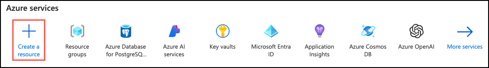
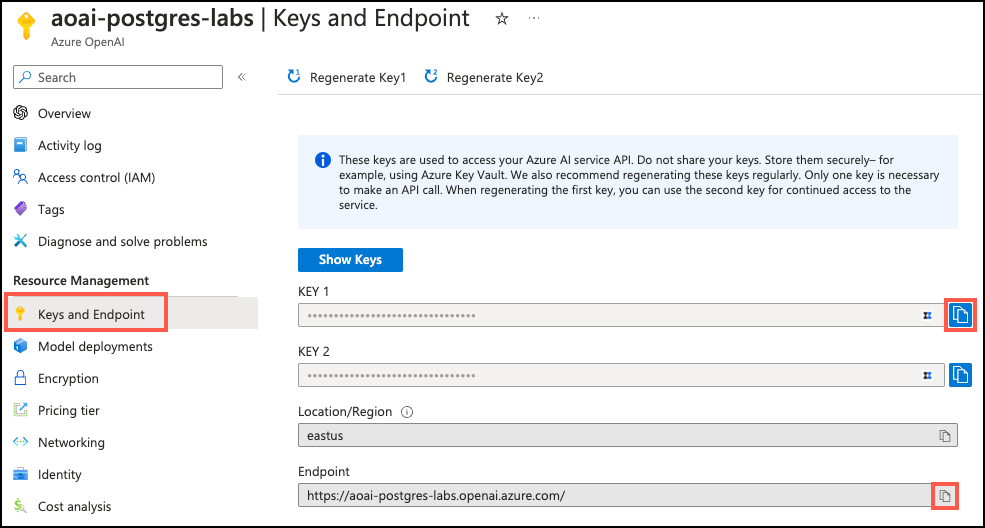
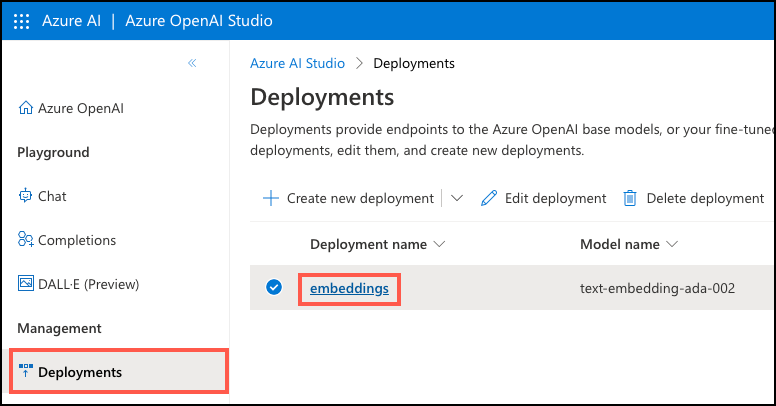
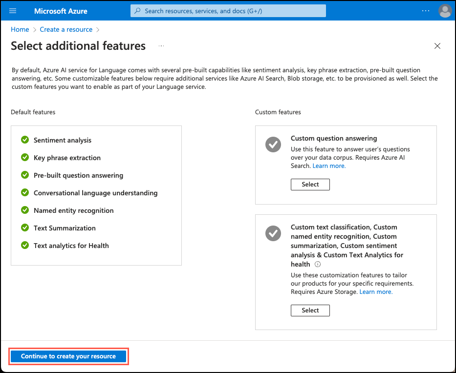
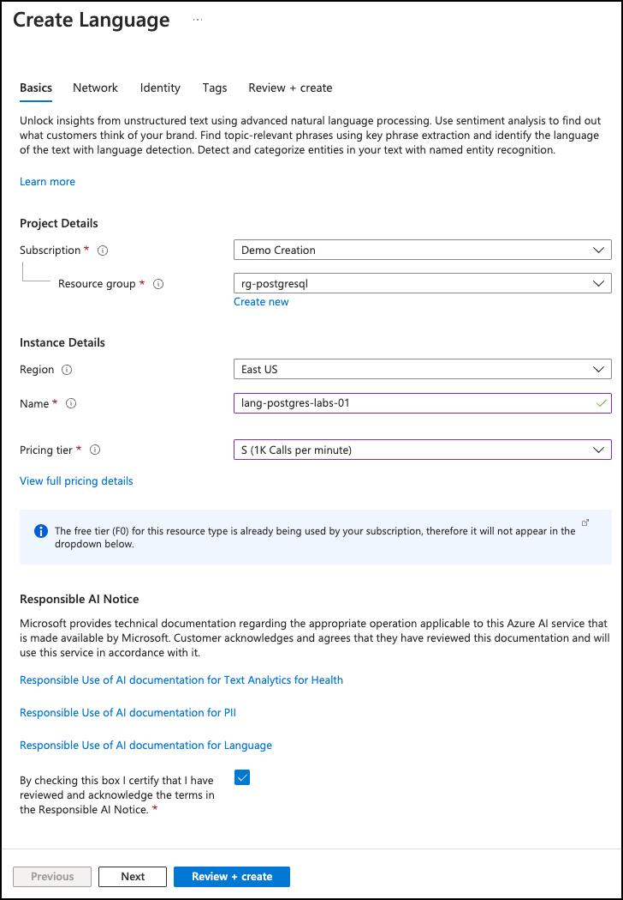
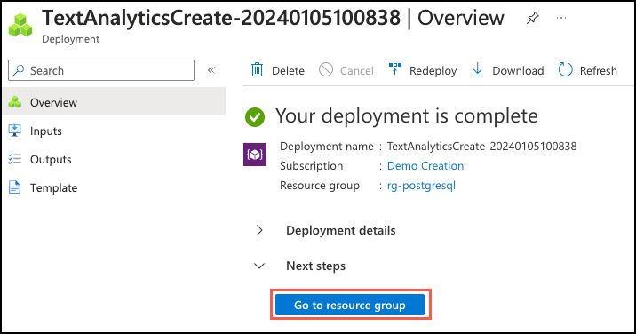
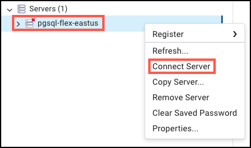
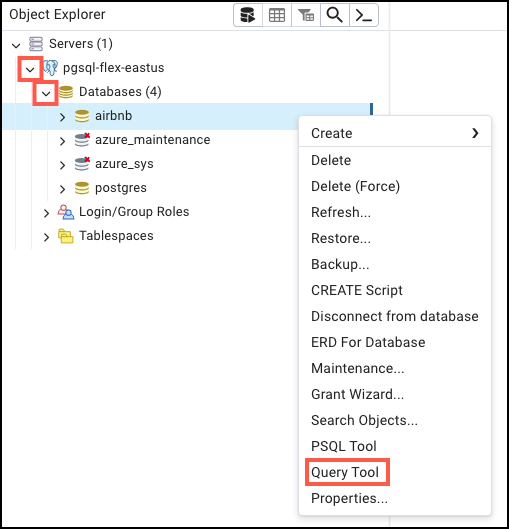

# Hands-on Lab: Generative AI with Azure Database for PostgreSQL Flexible Server

- [Hands-on Lab: Generative AI with Azure Database for PostgreSQL Flexible Server](#hands-on-lab-generative-ai-with-azure-database-for-postgresql-flexible-server)
  - [Setup](#setup)
    - [Required Resources](#required-resources)
    - [Software pre-requisites](#software-pre-requisites)
    - [Setup Database](#setup-database)
  - [Exercise 1: Add Azure AI and Vector extensions to allowlist](#exercise-1-add-azure-ai-and-vector-extensions-to-allowlist)
  - [Exercise 2: Create an Azure OpenAI resource](#exercise-2-create-an-azure-openai-resource)
    - [Task 1: Provision an Azure OpenAI service](#task-1-provision-an-azure-openai-service)
    - [Task 2: Deploy an embedding model](#task-2-deploy-an-embedding-model)
  - [Exercise 3: Install and configure the `azure_ai` extension](#exercise-3-install-and-configure-the-azure_ai-extension)
    - [Task 1: Connect to the database using psql in the Azure Cloud Shell](#task-1-connect-to-the-database-using-psql-in-the-azure-cloud-shell)
    - [Task 2: Install the `azure_ai` extension](#task-2-install-the-azure_ai-extension)
    - [Task 3: Review the objects contained within the `azure_ai` extension](#task-3-review-the-objects-contained-within-the-azure_ai-extension)
    - [Task 4: Set the Azure OpenAI endpoint and key](#task-4-set-the-azure-openai-endpoint-and-key)
  - [Exercise 4: Generate vector embeddings with Azure OpenAI](#exercise-4-generate-vector-embeddings-with-azure-openai)
    - [Task 1: Enable vector support with the pgvector extension](#task-1-enable-vector-support-with-the-pgvector-extension)
    - [Task 2: Generate and store vector embeddings](#task-2-generate-and-store-vector-embeddings)
    - [Task 3: Perform a vector similarity search](#task-3-perform-a-vector-similarity-search)
  - [Exercise 5: Integrate Azure AI Services](#exercise-5-integrate-azure-ai-services)
    - [Task 1: Provision an Azure AI Language service](#task-1-provision-an-azure-ai-language-service)
    - [Task 2: Set the Azure AI Language service endpoint and key](#task-2-set-the-azure-ai-language-service-endpoint-and-key)
    - [Task 3: Analyze the sentiment of reviews](#task-3-analyze-the-sentiment-of-reviews)
  - [Exercise 6: Execute a final query to tie it all together (Optional)](#exercise-6-execute-a-final-query-to-tie-it-all-together-optional)
    - [Task 1: Connect to the database using pgAdmin](#task-1-connect-to-the-database-using-pgadmin)
    - [Task 2: Execute a query and view results on a map](#task-2-execute-a-query-and-view-results-on-a-map)

[Generative AI](https://learn.microsoft.com/training/paths/introduction-generative-ai/) is a form of artificial intelligence in which [large language models](https://learn.microsoft.com/azure/postgresql/flexible-server/generative-ai-overview#large-language-model-llm) (LLMs) are trained to generate original content based on natural language input. LLMs are designed to understand and generate human-like language output and are known for their ability to perform a wide range of natural language understanding and generation tasks. Generative AI has a wide range of applications for data-driven applications, including semantic search, recommendation systems, and content generation, such as summarization, among many others.

In this lab, [Azure OpenAI](https://learn.microsoft.com/azure/ai-services/openai/overview) and the [Azure AI Language service](https://learn.microsoft.com/azure/ai-services/language-service/) will be used to integrate rich generative AI capabilities directly into the Azure Database for PostgreSQL Flexible Server using the [Azure AI Extension](https://learn.microsoft.com/azure/postgresql/flexible-server/generative-ai-azure-overview). The `azure_ai` extension adds the ability to leverage LLMs directly from a database.

## Setup

### Required Resources

Several resources are required to perform this lab. These include:

- Azure Database for PostgreSQL Flexible Server
- Azure OpenAI-enabled subscription

Create these resources using the PostgreSQL Flexible Server Developer Guide Setup documentation:

- [Deployment Instructions](../../../11_03_Setup/00_Template_Deployment_Instructions.md)

### Software pre-requisites

All this is done already in the lab setup scripts for the Lab virtual machine but is provided here for reference.

- Install pgAdmin

### Setup Database

- Run the following to set up the `airbnb` database, be sure to replace `SUFFIX`:

    ```powershell
    $filePath = "c:\labfiles\microsoft-postgresql-developer-guide\artifacts\data\airbnb.sql"
    
    $env:Path += ';C:\Program Files\PostgreSQL\16\bin'
    
    #set the password
    $env:PGPASSWORD="Solliance123"
    $serverName="pgsqldevSUFFIXflex16"
    $databaseName="airbnb"
    psql -h "$($serverName).postgres.database.azure.com" -d $databaseName -U s2admin -p 5432 -a -w -f $filePath
    ```

## Exercise 1: Add Azure AI and Vector extensions to allowlist

Throughout this lab, the [azure_ai](https://learn.microsoft.com/azure/postgresql/flexible-server/generative-ai-azure-overview) and [pgvector](https://learn.microsoft.com/azure/postgresql/flexible-server/how-to-use-pgvector) extensions will be used to add generative AI capabilities to a PostgreSQL database. In this exercise, these extensions will be added to the server's _allowlist_, as described in [how to use PostgreSQL extensions](https://learn.microsoft.com/azure/postgresql/flexible-server/concepts-extensions#how-to-use-postgresql-extensions).

1. In a web browser, navigate to the Azure Database for PostgreSQL Flexible Server resource in the [Azure portal](https://portal.azure.com/).

2. From the database's left-hand navigation menu, select **Server parameters** under **Settings**, then enter `azure.extensions` into the search box. Expand the **VALUE** dropdown list, then locate and check the box next to each of the following extensions:

    - AZURE_AI
    - VECTOR

    

3. Select **Save** on the toolbar, which will trigger a deployment on the database.

## Exercise 2: Create an Azure OpenAI resource

The `azure_ai` extension requires an underlying Azure OpenAI service to create [vector embeddings](https://learn.microsoft.com/azure/postgresql/flexible-server/generative-ai-overview#embeddings). In this exercise, an Azure OpenAI resource will be provisioned in the Azure portal along with an embedding model.

### Task 1: Provision an Azure OpenAI service

In this task, a new Azure OpenAI service will be created.

1. In a web browser, navigate to the [Azure portal](https://portal.azure.com/).

2. On the portal home page, select **Create a resource** under Azure services.

    

3. On the **Create a resource** page, enter `azure openai` into the search the marketplace box, then select the **Azure OpenAI** tile and select **Create** on the Azure OpenAI page.

    

4. On the Create Azure OpenAI **Basics** tab, enter the following information:

    | Parameter            | Value |
    | -------------------- | ----- |
    | **Project details**  |       |
    | Subscription         | Select the lab subscription. |
    | Resource group       | Select the lab resource group. |
    | **Instance details** |       |
    | Region               | For this lab, the `text-embedding-ada-002` (version 2) embedding model will be used. This model is currently only available in [certain regions](https://learn.microsoft.com/azure/ai-services/openai/concepts/models#embeddings-models). Please select a region from this list, such as `East US`, for this resource. |
    | Name                 | _Enter a globally unique name_, such as `aoai-postgres-labs-SUFFIX`, where `SUFFIX` is a unique string, such as your initials. |
    | Pricing tier         | Select **Standard S0**. |

    

    > Note: If a message displays that the Azure OpenAI Service is currently available to customers via an application form. The selected subscription has not been enabled for the service and does not have a quota for any pricing tiers; click the link to request access to the Azure OpenAI service and fill out the request form.

5. Select **Next** to move to the **Networking** tab.

6. On the **Networking** tab, select **All networks, including the internet, can access this resource**.

    

7. The default settings will be used for the remaining tabs of the storage account configuration, so select **Next** until the **Review** screen, then select the **Create** button on the **Review** tab to provision the Azure OpenAI service.

### Task 2: Deploy an embedding model

The `azure_ai` extension allows the creation of vector embeddings from text. Creating these embeddings requires a deployed `text-embedding-ada-002` (version 2) model within the Azure OpenAI service. In this task, use the [Azure OpenAI Studio](https://oai.azure.com/) to create a model deployment.

1. Navigate to the newly provisioned Azure OpenAI resource in the [Azure portal](https://portal.azure.com/).

2. On the resource's **Overview** page, select the **Go to Azure OpenAI Studio** button.

    

3. In Azure OpenAI Studio, select the **Deployments** tab under **Management** in the left-hand menu, then select **+ Create new deployment** from the toolbar.

    

4. In the **Deploy model** dialog, set the following:

    - **Select a model**: Choose `text-embedding-ada-002` from the list.
    - **Model version**: Ensure **2 (Default)** is selected.
    - **Deployment name**: Enter `embeddings`.

    

5. Select **Create** to deploy the model. After a few moments, the deployment will appear in the list of deployments.

## Exercise 3: Install and configure the `azure_ai` extension

In this exercise, the `azure_ai` extension will be installed into the database and configured to connect to the Azure OpenAI service.

### Task 1: Connect to the database using psql in the Azure Cloud Shell

In this task, the [psql command-line utility](https://www.postgresql.org/docs/current/app-psql.html) will be used from the [Azure Cloud Shell](https://learn.microsoft.com/azure/cloud-shell/overview) to connect to the database.

1. In order to connect, the connection details for the database will be required. Navigate to the Azure Database for PostgreSQL Flexible Server resource in the [Azure portal](https://portal.azure.com/), and in the left-hand navigation menu, select **Connect** under **Settings**.

    

2. With the **Connect** page open, select the **Cloud Shell** icon in the Azure portal toolbar to open a new [Cloud Shell](https://learn.microsoft.com/azure/cloud-shell/overview) pane at the top of the browser window.

    

3. From the database's **Connect** page in the Azure portal, select **airbnb** for the **Database name**, then copy the **Connection details** block and paste it into the Cloud Shell.

    

4. At the Cloud Shell prompt, replace the `{your_password}` token with the password assigned to the `wsuser` user when creating the database, then run the command. If using the lab setup, the password should be `Solliance123`.

5. Connect to the database using the `psql` command-line utility by entering the following at the prompt:

    ```bash
    psql
    ```

    Connecting to the database from the Cloud Shell requires that the `Allow public access from any Azure service within Azure to the server` box is checked on the **Networking** page of the database. If a message displays that the connection was not successful, please verify this is checked and try again.

### Task 2: Install the `azure_ai` extension

The `azure_ai` extension allows the usage of Azure OpenAI and Azure Cognitive Services into the database. To enable the extension in the database, follow the steps below:

1. Verify that the extension is successfully added to the allowlist by running the following from the `psql` command prompt:

    ```sql
    SHOW azure.extensions;
    ```

2. Install the `azure_ai` extension using the [CREATE EXTENSION](https://www.postgresql.org/docs/current/sql-createextension.html) command.

    ```sql
    CREATE EXTENSION IF NOT EXISTS azure_ai;
    ```

### Task 3: Review the objects contained within the `azure_ai` extension

Reviewing the objects within the `azure_ai` extension can provide a better understanding of its capabilities. In this task, the various schemas, user-defined functions (UDFs), and composite types added to the database by the extension will be reviewed.

1. Use the [`\dx` meta-command](https://www.postgresql.org/docs/current/app-psql.html#APP-PSQL-META-COMMAND-DX-LC) from the `psql` command prompt to list the objects contained within the extension.

    ```psql
    \dx+ azure_ai
    ```

    The meta-command output shows the `azure_ai` extension creates three schemas, multiple user-defined functions (UDFs), and several composite types in the database. The table below lists the schemas added by the extension and describes each.

    | Schema | Description |
    | ------ | ----------- |
    | `azure_ai` | The principal schema where the configuration table and UDFs for interacting with it reside. |
    | `azure_openai` | Contains the UDFs that enable calling an Azure OpenAI endpoint. |
    | `azure_cognitive` | Provides UDFs and composite types related to integrating the database with Azure Cognitive Services. |

2. The functions and types are all associated with one of the schemas. To review the functions defined in the `azure_ai` schema, use the `\df` meta-command, specifying the schema whose functions should be displayed. The `\x auto` command preceding `\df` allows the expanded display to be automatically applied when necessary to make the output from the command easier to view in the Azure Cloud Shell.

    ```sql
    \x auto
    ```

    ```sql
    \df+ azure_ai.*
    ```

    The `azure_ai.set_setting()` function will set the endpoint and key values for Azure AI services. It accepts a **key** and the **value** to assign it. The `azure_ai.get_setting()` function provides a way to retrieve the values set with the `set_setting()` function. It accepts the **key** of the setting to view. For both methods, the key must be one of the following:

    | Key | Description |
    | --- | ----------- |
    | `azure_openai.endpoint` | A supported OpenAI endpoint (e.g., <https://example.openai.azure.com>). |
    | `azure_openai.subscription_key` | A subscription key for an OpenAI resource. |
    | `azure_cognitive.endpoint` | A supported Cognitive Services endpoint (e.g., <https://example.cognitiveservices.azure.com>). |
    | `azure_cognitive.subscription_key` | A subscription key for a Cognitive Services resource. |

    > Important
    >
    > Because the connection information for Azure AI services, including API keys, is stored in a configuration table in the database, the `azure_ai` extension defines a role called `azure_ai_settings_manager` to ensure this information is protected and accessible only to users assigned that role. This role enables reading and writing of settings related to the extension. Only superusers and members of the `azure_ai_settings_manager` role can invoke the `azure_ai.get_setting()` and `azure_ai.set_setting()` functions. In Azure Database for PostgreSQL Flexible Server, all admin users are assigned the `azure_ai_settings_manager` role.

### Task 4: Set the Azure OpenAI endpoint and key

Before using the `azure_openai` functions, configure the extension to the Azure OpenAI service endpoint and key.

1. Using the same browser tab where the Cloud Shell is open, navigate to the Azure OpenAI resource in the [Azure portal](https://portal.azure.com/) and select the **Keys and Endpoint** item under **Resource Management** from the left-hand menu, then copy the endpoint and access key.

    

    Use either `KEY1` or `KEY2`. Always having two keys allows for the secure rotation and regeneration of keys without causing service disruption.

2. In the command below, replace the `{endpoint}` and `{api-key}` tokens with the values from the Azure portal, then run the commands from the `psql` command prompt in the Cloud Shell pane to add the values to the configuration table.

    ```sql
    SELECT azure_ai.set_setting('azure_openai.endpoint','{endpoint}');
    SELECT azure_ai.set_setting('azure_openai.subscription_key', '{api-key}');
    ```

3. Verify the settings written in the configuration table using the following queries:

    ```sql
    SELECT azure_ai.get_setting('azure_openai.endpoint');
    SELECT azure_ai.get_setting('azure_openai.subscription_key');
    ```

    The `azure_ai` extension is now connected to the Azure OpenAI account and ready to generate vector embeddings.

## Exercise 4: Generate vector embeddings with Azure OpenAI

The `azure_ai` extension's `azure_openai` schema enables Azure OpenAI to create vector embeddings for text values. Using this schema, you can [generate embeddings with Azure OpenAI](https://learn.microsoft.com/azure/ai-services/openai/how-to/embeddings) directly from the database to create vector representations of input text, which can then be used in vector similarity searches, as well as consumed by machine learning models.

[Embeddings](https://learn.microsoft.com/azure/postgresql/flexible-server/generative-ai-overview#embeddings) are a concept in machine learning and natural language processing (NLP) that involves representing objects, such as words, documents, or entities, as [vectors](https://learn.microsoft.com/azure/postgresql/flexible-server/generative-ai-overview#vectors) in a multi-dimensional space. Embeddings allow machine learning models to evaluate how closely related information is. This technique efficiently identifies relationships and similarities between data, allowing algorithms to identify patterns and make accurate predictions.

### Task 1: Enable vector support with the pgvector extension

The `azure_ai` extension allows for the generation of embeddings for input text. To enable the generated vectors to be stored alongside the rest of the data in the database, the `pgvector` extension must be installed by following the guidance in the [enable vector support in the database](https://learn.microsoft.com/azure/postgresql/flexible-server/how-to-use-pgvector#enable-extension) documentation.

1. Install the `pgvector` extension using the [CREATE EXTENSION](https://www.postgresql.org/docs/current/sql-createextension.html) command.

    ```sql
    CREATE EXTENSION IF NOT EXISTS vector;
    ```

2. With vector support added to the database, add a new column to the `listings` table using the `vector` data type to store embeddings within the table. The `text-embedding-ada-002` model produces vectors with 1536 dimensions, `1536` must be specified as the vector size.

    ```sql
    ALTER TABLE listings
    ADD COLUMN description_vector vector(1536);
    ```

### Task 2: Generate and store vector embeddings

The `listings` table is now ready to store embeddings. Using the `azure_openai.create_embeddings()` function, create vectors for the `description` field and insert them into the newly created `description_vector` column in the `listings` table.

1. Before using the `create_embeddings()` function, run the following command to inspect it and review the required arguments:

    ```sql
    \df+ azure_openai.*
    ```

    The `Argument data types` property in the output of the `\df+ azure_openai.*` command reveals the list of arguments the function expects.

    | Argument | Type | Default | Description |
    | -------- | ---- | ------- | ----------- |
    | deployment_name | `text` || Name of the deployment in Azure OpenAI studio that contains the `text-embeddings-ada-002` model. |
    | input | `text` || Input text used to create embeddings. |
    | timeout_ms | `integer` | 3600000 | Timeout in milliseconds after which the operation is stopped. |
    | throw_on_error | `boolean` | true | Flag indicating whether the function should, on error, throw an exception resulting in a rollback of the wrapping transactions. |

2. The first argument required by the `azure_openai.create_embeddings()` function is the `deployment_name`. This name is assigned when during deployment of the embedding model in the Azure OpenAI account. To retrieve this value, return to [Azure OpenAI Studio](https://oai.azure.com/) and select **Deployments** under **Management** in the left-hand navigation menu. On the **Deployments** page, copy the **Deployment name** value associated with the `text-embedding-ada-002` model deployment.

    

3. Using the deployment name, run the following query to update each record in the `listings` table, inserting the generated vector embeddings for the `description` field into the `description_vector` column using the `azure_openai.create_embeddings()` function. Replace `{your-deployment-name}` with the **Deployment name** value copied from the Azure OpenAI Studio **Deployments** page. **IMPORTANT**: Rerun the above query until all the records are updated. Successfully updating all rows will be indicated by an output that reads `UPDATE ##`, where `##` is a number less than 100.

    ```sql
    WITH empty_vectors AS (
        SELECT listing_id FROM listings
        WHERE description_vector IS NULL
        AND description <> ''
        LIMIT 100
    )
    UPDATE listings l
    SET description_vector = azure_openai.create_embeddings('{your-deployment-name}', description, throw_on_error => false)
    WHERE listing_id IN (SELECT listing_id FROM empty_vectors);
    ```

    The above query uses a common table expression (CTE) to retrieve records from the `listings` table where the `description_vector` field is null and the `description` field is not an empty string. This CTE also includes `LIMIT 100` to reduce the number of records returned to only the first 100. The query then attempts to update the `description_vector` column with a vector representation of the `description` column using the `azure_openai.create_embeddings` function. The limited number of records when performing this update is to prevent the calls from exceeding the call rate limit of the Azure OpenAI service. The `throw_on_error` parameter is false, allowing the query to proceed if the rate limit is exceeded. If the limit is exceeded, a warning like the following will display:

    ```sql
    WARNING:  azure_ai::azure_ai: 429: Requests to the Get a vector representation of a given input that can be easily consumed by machine learning models and algorithms. Operation under Azure OpenAI API version 2023-05-15 have exceeded call rate limit of the current OpenAI S0 pricing tier. Please retry after 1 second. Please go here: https://aka.ms/oai/quotaincrease to further increase the default rate limit.
    ```

4. Verify that the `description_vector` column has been populated for all `listings` records by running the following query:

    ```sql
    SELECT COUNT(*) FROM listings WHERE description_vector IS NULL AND description <> '';
    ```

    The result of the query should be a count of 0.

### Task 3: Perform a vector similarity search

Vector similarity is a method used to measure two items' similarity by representing them as vectors, which are series of numbers. Vectors are often used to perform searches using LLMs. Vector similarity is commonly calculated using distance metrics, such as Euclidean distance or cosine similarity. Euclidean distance measures the straight-line distance between two vectors in the n-dimensional space, while cosine similarity measures the cosine of the angle between two vectors. Each embedding is a vector of floating point numbers, so the distance between two embeddings in the vector space correlates with the semantic similarity between two inputs in the original format.

1. To enable more efficient searching over the `vector` field by creating an index on `listings` using cosine distance and [HNSW](https://github.com/pgvector/pgvector#hnsw), which is short for Hierarchical Navigable Small World. HNSW allows `pgvector` to utilize the latest graph-based algorithms to approximate nearest-neighbor queries.

    ```sql
    CREATE INDEX ON listings USING hnsw (description_vector vector_cosine_ops);
    ```

2. With everything now in place, execute a [cosine similarity](https://learn.microsoft.com/azure/ai-services/openai/concepts/understand-embeddings#cosine-similarity) search query against the database. Run the query below to do a vector similarity search against listing descriptions. The embeddings are generated for an input question and then cast to a vector array (`::vector`), which allows it to be compared against the vectors stored in the `listings` table.

    ```sql
    SELECT listing_id, name, description FROM listings
    ORDER BY description_vector <=> azure_openai.create_embeddings('embeddings', 'Properties with a private room near Discovery Park')::vector
    LIMIT 3;
    ```

    The query uses the `<=>` [vector operator](https://github.com/pgvector/pgvector#vector-operators), which represents the "cosine distance" operator used to calculate the distance between two vectors in a multi-dimensional space.

## Exercise 5: Integrate Azure AI Services

The Azure AI services integrations included in the `azure_cognitive` schema of the `azure_ai` extension provide a rich set of AI Language features accessible directly from the database. The functionalities include sentiment analysis, language detection, key phrase extraction, entity recognition, and text summarization. These capabilities are enabled through the [Azure AI Language service](https://learn.microsoft.com/azure/ai-services/language-service/overview).

To review the complete list of Azure AI capabilities accessible through the extension, view the [Integrate Azure Database for PostgreSQL Flexible Server with Azure Cognitive Services documentation](https://learn.microsoft.com/azure/postgresql/flexible-server/generative-ai-azure-cognitive).

### Task 1: Provision an Azure AI Language service

An [Azure AI Language](https://learn.microsoft.com/azure/ai-services/language-service/overview) service is required to take advantage of the `azure_ai` extensions cognitive functions. In this exercise, an Azure AI Language service will be provisioned.

1. In a web browser, navigate to the [Azure portal](https://portal.azure.com/).

2. On the portal home page, select **Create a resource** under Azure services.

    

3. On the **Create a resource** page, select `AI + Machine Learning` from the left-hand menu, then select **Language service**.

    

4. On the **Select additional features** dialog, select **Continue to create your resource**.

    

5. On the Create Language **Basics** tab, enter the following:

    | Parameter            | Value |
    | -------------------- | ----- |
    | **Project details**  |       |
    | Subscription         | Select the lab subscription. |
    | Resource group       | Select the lab resource group. |
    | **Instance details** |       |
    | Region               | Select the region used for the Azure Database for PostgreSQL Flexible Server resource. |
    | Name                 | _Enter a globally unique name_, such as `lang-postgres-labs-SUFFIX`, where `SUFFIX` is a unique string, such as your initials. |
    | Pricing tier         | Select the standard pricing tier, **S (1K Calls per minute)**. |
    | Responsible AI Notice | Check the box to certify you have reviewed and acknowledged the Responsible AI Notice. |

    

6. The default settings will be used for the remaining tabs of the Language service configuration, so select the **Review + create** button.

7. Select the **Create** button on the **Review + create** tab to provision the Language service.

8. Select **Go to resource group** on the deployment page when the language service deployment is complete.

    

### Task 2: Set the Azure AI Language service endpoint and key

As with the `azure_openai` functions, to successfully make calls against Azure AI services using the `azure_ai` extension, an endpoint and a key for the Azure AI Language service must be provided.

1. Using the same browser tab where the Cloud Shell is open, navigate to the Language service resource in the [Azure portal](https://portal.azure.com/) and select the **Keys and Endpoint** item under **Resource Management** from the left-hand navigation menu.

    

2. Copy the endpoint and access key values, then in the command below, replace the `{endpoint}` and `{api-key}` tokens with values retrieved from the Azure portal. Run the commands from the `psql` command prompt in the Cloud Shell to add the values to the configuration table.

    ```sql
    SELECT azure_ai.set_setting('azure_cognitive.endpoint','{endpoint}');
    SELECT azure_ai.set_setting('azure_cognitive.subscription_key', '{api-key}');
    ```

### Task 3: Analyze the sentiment of reviews

In this task, the `azure_cognitive.analyze_sentiment` function will be used to evaluate reviews of Airbnb listings.

1. To perform sentiment analysis using the `azure_cognitive` schema in the `azure_ai` extension, use the `analyze_sentiment` function. Run the command below to review the function:

    ```sql
    \df azure_cognitive.analyze_sentiment
    ```

    The output shows the function's schema, name, result data type, and argument data types. This information helps in gaining an understanding of how to use the function.

2. It is also essential to understand the structure of the result data type the function outputs and understand how to correctly handle its return value. Run the following command to inspect the `sentiment_analysis_result` type:

    ```sql
    \dT+ azure_cognitive.sentiment_analysis_result
    ```

3. The output of the above command reveals the `sentiment_analysis_result` type is a `tuple`. To understand the structure of that `tuple`,  run the following command to look at the columns contained within the `sentiment_analysis_result` composite type:

    ```sql
    \d+ azure_cognitive.sentiment_analysis_result
    ```

    The output of that command should look like the following:

    ```sql
                     Composite type "azure_cognitive.sentiment_analysis_result"
         Column     |       Type       | Collation | Nullable | Default | Storage  | Description 
    ----------------+------------------+-----------+----------+---------+----------+-------------
     sentiment      | text             |           |          |         | extended | 
     positive_score | double precision |           |          |         | plain    | 
     neutral_score  | double precision |           |          |         | plain    | 
     negative_score | double precision |           |          |         | plain    |
    ```

    The `azure_cognitive.sentiment_analysis_result` is a composite type containing the sentiment predictions of the input text. It includes the sentiment, which can be positive, negative, neutral, or mixed, and the scores for positive, neutral, and negative aspects found in the text. The scores are represented as real numbers between 0 and 1. For example, in (neutral,0.26,0.64,0.09), the sentiment is neutral with a positive score of 0.26, neutral of 0.64, and negative at 0.09.

4. With an understanding of how to analyze sentiment using the extension and the shape of the return type, execute the following query that looks for reviews that are overwhelmingly positive:

    ```sql
    WITH cte AS (
        SELECT id, azure_cognitive.analyze_sentiment(comments, 'en') AS sentiment FROM reviews LIMIT 100
    )
    SELECT
        id,
        (sentiment).sentiment,
        (sentiment).positive_score,
        (sentiment).neutral_score,
        (sentiment).negative_score
    FROM cte
    WHERE (sentiment).positive_score > 0.98
    LIMIT 10;
    ```

    The above query uses a common table expression or CTE to get the sentiment scores for the first three records in the `reviews` table. It then selects the `sentiment` composite type columns from the CTE to extract the individual values from the `sentiment_analysis_result`.

## Exercise 6: Execute a final query to tie it all together (Optional)

In this exercise, **pgAdmin** will be used to connect to the database and execute a final query that ties together the previous work with the `azure_ai`, `postgis`, and `pgvector` extensions.

### Task 1: Connect to the database using pgAdmin

Previously, [pgAdmin](https://www.pgadmin.org/download/) was downloaded and installed and then a registered connection to the database server was added. In this task, pgAdmin will be used to query the database.

1. Open **pgAdmin** on the local or lab virtual machine.

2. Expand the **Servers** node within the Object Explorer, select the database server from the list, then right-click the server and select **Connect Server** from the context menu.

    
  
3. Once connected to the server, expand the **Databases** node and select the **airbnb** database. Right-click the **airbnb** database and select **Query Tool** from the context menu.

    

### Task 2: Execute a query and view results on a map

In this task, run a final query that ties together the work.

1. Run the below query that incorporates elements of the `azure_ai` and `PostGIS` extensions:

    ```sql
    WITH listings_cte AS (
        SELECT l.listing_id, name, listing_location, summary FROM listings l
        INNER JOIN calendar c ON l.listing_id = c.listing_id
        WHERE ST_DWithin(
            listing_location,
            ST_GeomFromText('POINT(-122.410347 47.655598)', 4326),
            0.025
        )
        AND c.date = '2016-01-13'
        AND c.available = 't'
        AND c.price <= 75.00
        AND l.listing_id IN (SELECT listing_id FROM reviews)
        ORDER BY description_vector <=> azure_openai.create_embeddings('embeddings', 'Properties with a private room near Discovery Park')::vector
        LIMIT 3
    ),
    sentiment_cte AS (
        SELECT r.listing_id, comments, azure_cognitive.analyze_sentiment(comments, 'en') AS sentiment
        FROM reviews r
        INNER JOIN listings_cte l ON r.listing_id = l.listing_id
    )
    SELECT
        l.listing_id,
        name,
        listing_location,
        summary,
        avg((sentiment).positive_score) as avg_positive_score,
        avg((sentiment).neutral_score) as avg_neutral_score,
        avg((sentiment).negative_score) as avg_negative_score
    FROM sentiment_cte s
    INNER JOIN listings_cte l on s.listing_id = l.listing_id
    GROUP BY l.listing_id, name, listing_location, summary;
    ```

2. In the **Data Output** panel, select the **View all geometries in this column** button displayed in the `listing_location` column of the query results.

    

    The **View all geometries in this column** button opens the **Geometry Viewer**, allowing the viewing of the query results on a map.

3. Select one of the three points displayed on the map to view details about the location, including the average positive, neutral, and negative sentiment scores across all ratings for the property.

    
