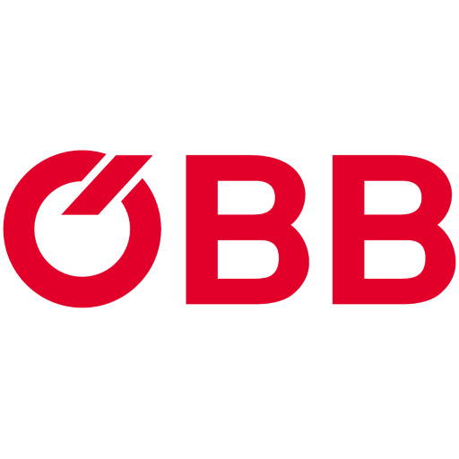

# 09 / Customer stories

Azure Database for PostgreSQL Flexible Server is used by customers worldwide, and many have shared their stories on the [Microsoft Customer Stories portal](https://customers.microsoft.com/).

## Case studies

The following is a set of case studies from the Microsoft Customer Stories page focused on the usage of Azure Database for PostgreSQL Flexible Server.

### Allego

Allego, a leading provider of electric vehicle (EV) charging solutions, details how they [successfully scaled their EV growth using Azure Database for PostgreSQL Flexible Server](https://customers.microsoft.com/story/1518694211546313965-allego-scales-ev-growth-azure-database-postgresql-flexible-server), a cloud-based database management service. Allego faced the challenge of managing a rapidly growing amount of EV charging data, which required a reliable and scalable solution. By implementing Azure Database for PostgreSQL Flexible Server, Allego optimized its database performance, improved scalability, control costs and streamline operations.

The EOL(end-of-life) of their existing database solution, PostgreSQL 9.6 using Azure Database for PostgreSQL - Single Server led to the adoption of Azure Database for PostgreSQL Flexible Server. The single server architecture could not meet the growing demands of Allego's business due to its limits on capacity, scalability, operating system, and PostgreSQL version support. To address these issues, they initiated a migration to Azure Database for PostgreSQL Flexible Server.

The migration of data between the two database solutions was simplified using the [Single to Flexible Server migration tool](https://learn.microsoft.com/azure/postgresql/migrate/concepts-single-to-flexible) that allowed Allegro to migrate their data online without an impact on production.

### Scandinavian Airlines

Scandinavian Airlines (SAS) details their successful utilization of [Azure Database for PostgreSQL Flexible Server to accelerate application development and reduce costs](https://customers.microsoft.com/story/1431763554334987166-scandinavian-airlines-speeds-app-development-lowers-costs-azure-database-postgresql). SAS, one of the leading airlines in Europe, relies on Azure to lower its infrastructure costs and gain agility for its development teams. With a large migration of applications to Azure underway, they leveraged Azure Kubernetes Service (AKS), however, SAS also needed a highly available PostgreSQL database solution for their high-concurrency applications. Through the adoption of Azure Database for PostgreSQL Flexible Server, SAS simplified its application architecture and reduced costs by eliminating infrastructure management and pausing services when not in use.

### Austrian Federal Railways

Austrian Federal Railways (ÖBB) successfully migrated its Ticketshop platform to Microsoft Azure, enabling faster software releases and increased scalability. The Ticketshop platform, which serves as a one-stop shop for passengers buying railway tickets and other services, previously ran on ÖBB's on-premises data center. By leveraging Azure's hybrid platform, ÖBB delivered a unified user experience across multiple sales channels and extended Ticketshop as a business-to-business service. The migration involved containerizing the Ticketshop app and using Kubernetes to manage the cluster, as well as migrating the data from Oracle databases to Azure Database for PostgreSQL Flexible Server.

ÖBB's migration to Azure not only improved efficiency but also reduced costs and complexity. The pay-as-you-go flexibility of Azure's platform-as-a-service (PaaS) model eliminated the need for ÖBB to manage software licenses, while Azure's managed services, such as Azure Database for PostgreSQL Flexible Server and Azure Cache for Redis, streamlined the infrastructure and improved performance. The successful migration has positioned ÖBB to expand Ticketshop across Austria and explore further service innovations using Azure. ÖBB praises Microsoft's support and partnership throughout the project, highlighting Azure as the key to their cloud journey.
