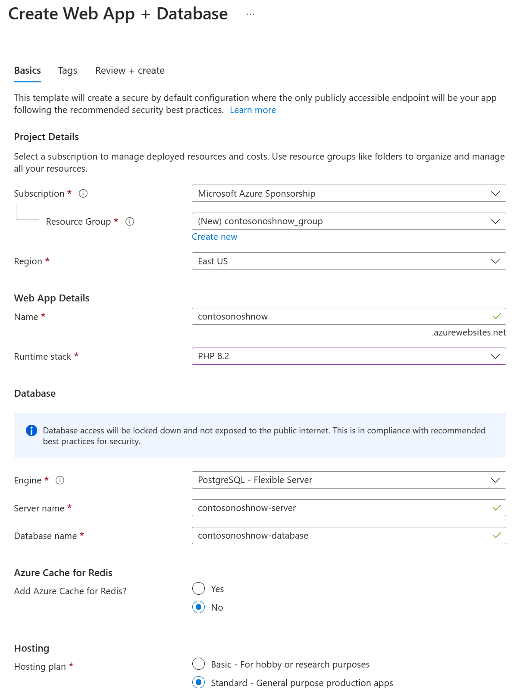
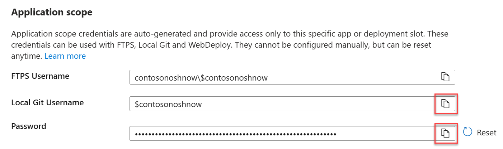
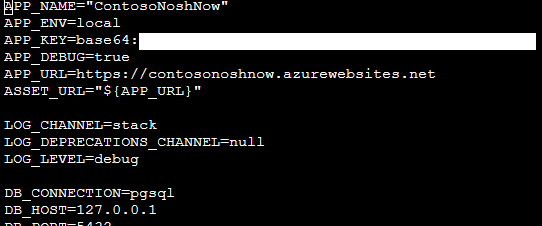
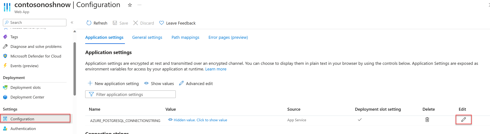
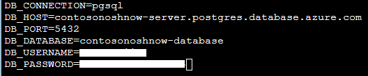
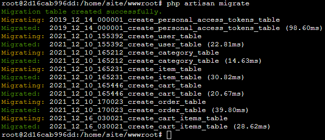

## Running the sample application

Instead of learning multiple sample applications, the guide focused on evolving deployment strategies. Readers should learn the sample application structure once and focus on how the application will need to be modified to fit the deployment model.

### Site map


### Sample Application Prerequisites

- Azure subscription
- Git

### Quick start: manual Azure set up instructions

As part of this guide, there are environment automation setup scripts provided that will build and configure much of the environment needed for the sample application. It is important to understand the basic Azure **concepts** before running the automated scripts. Walking through each step will help provide additional context and learning opportunities. The scripts will create an environment in a few minutes rather than requiring to walk through lengthy setup exercises.

The Azure App Service uses this [Docker image](https://github.com/Azure-App-Service/nginx-fpm) for its 8.x container builds.

> **Warning**: Outdated runtimes are periodically removed from the Web Apps Create and Configuration blades in the Portal. These runtimes are hidden from the Portal when they are deprecated by the maintaining organization or found to have significant vulnerabilities. These options are hidden to guide customers to the latest runtimes where they will be the most successful. Older Azure App Service Docker images can be found [here](https://github.com/Azure-App-Service/php).

### Sample application deployment steps

**Deploying to PHP 8.x**

The deployment strategy applied in this sample application focuses on updating project environment variables instead of global environment variable configuration.

1. Log into the Azure Portal.
2. Search for Marketplace.
3. While in the Marketplace, search for and create Azure Web App + Database resources in the Marketplace.

   - Select the Marketplace button.
  
      

   - Enter `Web App + Database` in the search box.
   - Select the Microsoft Web App + Database search result.

      

4. Create a web application and database.

    

   - Choose the subscription.

   - Create a new resource group

   - Choose a region.

   - Create a unique web app name.

   - Select the runtime stack. The web app is only tested with PHP 8.x.

   - Create the resources.

5. After the resources have been deployed, locate the App Service in the Resource Group.
  
   - Select the **Deployment Center** and capture the configuration settings.

   - In the Settings tab, choose Local Git.

    

   - Select **Save** at the top.

    > **Note:** Alternative Azure CLI command:

    ```cmd
    az webapp deployment source config-local-git --name <app-name> --resource-group <group-name>
    ```

   - Capture the **Git Clone Uri**. Later exercises will be pushing the application files to the Azure App Service local storage from the development machine.
  
      

   - On the **Local Git/FTPS credentials**, capture the Application Scope local Git username and password to be used later. Make sure to capture only the user name.

     

6. Clone the sample **ContosoNoshNow** application to the local development machine from the Microsoft Git repository:

   TODO: Get the MS repo.

   - Open the command prompt or terminal on the development machine.

   - Type the following commands individually to configure the remote repo connection. Review the output:

      ```cmd
      git remote add azure <Azure App Service Git Clone URL>
      git remote -v
      git push azure master
      ```

   - When pushing content to the Azure App Service, the systems will prompt for the Local Git credentials. Enter the Application Scope credentials.

      

      If a mistake is made entering the credentials, use the Credential Manager to update the credentials.

   - The following output should display in the command window:

      

7. Return to the Azure Portal. Navigate to the App Service. Find the **Development Tools** section. Log into App Service SSH terminal.

   

8. Verify the sample application files have been copied into the wwwroot directory.

   ```bash
   cd /home/site/wwwroot
   ls -la
   ```

9. Run the Composer update command in the wwwroot directory, which will import the packages and create the vendor folder, along with the autoload script (../vendor/autoload.php).

    ```bash
    cp /home/site/repository/.env.example.azure /home/site/wwwroot/.env
    curl -sS https://getcomposer.org/installer | php
    composer.phar update
    ```
  
10. Generate Laravel application key. This command will update the **.env** file.
  
    ```bash
    php artisan key:generate
    ```

11. Update the **APP_URL** parameter in the .env file with the Azure App Service URL and save the changes.

      ```bash
      nano /home/site/wwwroot/.env
      ```

      

12. Copy the Nginx default to the home default. By default, App Service set WEBSITES_ENABLE_APP_SERVICE_STORAGE = true. Files stored in /home path are persisted in an Azure Storage file share, which can survive restart and shared across scale instances. Due to this, save the Nginx configure file under the `/home` path.

    ```bash
    cp /etc/nginx/sites-enabled/default /home/default
    ```

13. Update the Nginx home default.

      ```bash
      nano /home/default
      ```

      - absolute_redirect off
      - root /home/site/wwwroot/public
      - try_files $uri $uri/ /index.php$is_args$args;
  
      

14. Restart the service.

      ```bash
      service nginx restart
      ```

15. The configuration needs to survive an App Service restart. Update the App Service Startup Command.

       - Navigate to the **Settings** section.
       - Select **Configuration**.
       - Select the **General settings**.
       - Enter the following command in the **Startup Command**:
  
      ```bash
      cp /home/default /etc/nginx/sites-enabled/default; service nginx restart
      ```

      

16. Open a browser and view the application.

    

   > **Note:** Notice the message in red at the bottom of the web page. "Site is unable to pull from database. Using JSON data instead."

## Connecting to the database

The application should now be available and show some sample data, however the web application is not reading or writing to the database. Let us go through the steps to configure the database configuration information.

1. In the Azure Portal, navigate to the App Service and select **Configuration** from the left menu.

2. Beneath the Application settings heading, locate the `AZURE_POSTGRESQL-CONNECTIONSTRING` setting. Select the **Edit** button at the end of the row.

   

3. In the Add/Edit application setting blade, extract the following details:

   - host
   - dbname
   - user
   - password
  
   > **Note:** For production environments, values will be retrieved from Azure Key Vault.

4. With the database connection information in hand, open the App Service SSH console and configure the **.env** project file.

   ```bash
   nano /home/site/wwwroot/.env
   ```

   

   Update the following environment variables:
   - DB_HOST
   - DB_DATABASE
   - DB_USERNAME
   - DB_PASSWORD
  
5. Run the `php artisan migrate` command to create the tables in the contosonoshnow database. Note: Ensure the command path is in the `/home/site/wwwroot` directory when executing this command.

   ```bash
   php artisan migrate
   ```

   

6. Run the `php artisan db:seed` command to seed the database with sample data values.

   ```bash
   php artisan db:seed
   ```

7. Navigate back to the web app and enter a sample order. Notice the red bar at the bottom of the page is gone. The application is now reading and writing to the database.

   

### What happens to my app during an Azure deployment?

All the officially supported deployment methods make changes to the files in the /home/site/wwwroot folder of the app. These files are used to run the application. The web framework of choice may use a subdirectory as the site root. For example, Laravel, uses the public/ subdirectory as the site root.

The environment variable could be set globally or at the project level. Setting the environment variables at the project level, when possible, allows for deployment independence and reduces the likelihood of dependency collision.

### Troubleshooting tips

- Select the App Service in the Azure Portal. In the **Monitoring** section, select **Log Stream**.
- [Troubleshoot connection issues to Azure Database for PostgreSQL Flexible Server](https://learn.microsoft.com/azure/postgresql/flexible-server/howto-troubleshoot-common-connection-issues)
- Running `php -i` at the Azure App Service SSH console will provide valuable configuration information.
- Azure App Service 8.0 php.ini location - `cat /usr/local/etc/php/php.ini-production`
- [Configure a PHP app for Azure App Service - Access diagnostic logs](https://learn.microsoft.com/azure/app-service/configure-language-php?pivots=platform-linux#access-diagnostic-logs)
- [Deploying a Laravel application to Nginx server.](https://laravel.com/docs/8.x/deployment#nginx)
- [Local Git deployment to Azure App Service](https://learn.microsoft.com/azure/app-service/deploy-local-git?tabs=cli)

## Recommended content

- [How PHP apps are detected and built.](https://github.com/microsoft/Oryx/blob/main/doc/runtimes/php.md)
