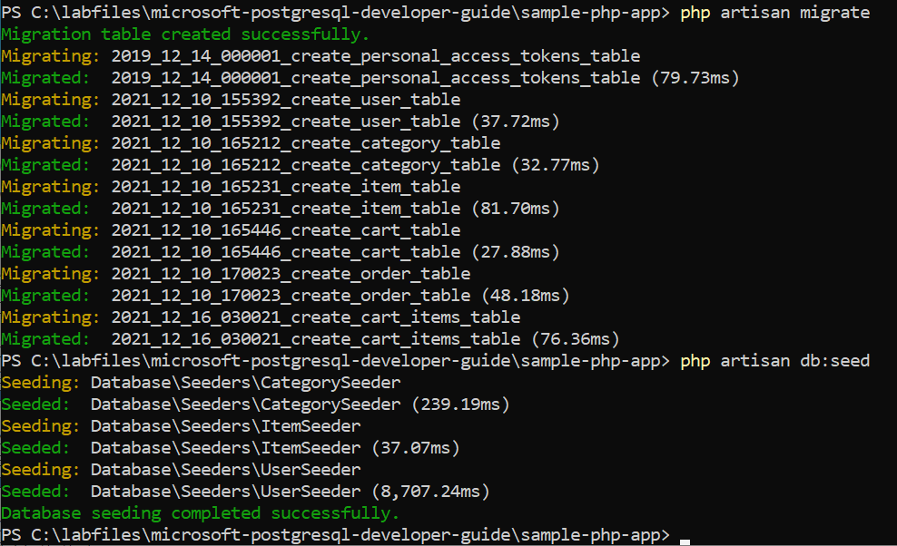
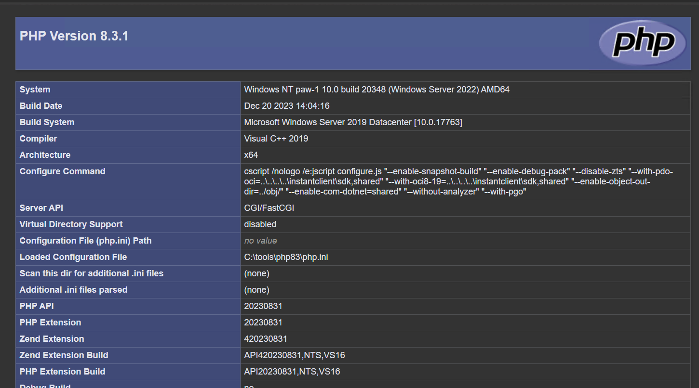
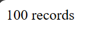

# AppMod 01 : Classic Deployment to PHP-enabled IIS server

This is a simple app that runs PHP code to connect to a PostgreSQL database. These tasks will be performed on the **pgsqldevSUFFIX-win11** virtual machine deployed via the ARM template.

## Required Resources

Several resources are required to perform this lab. These include:

- Development Server with web server and PHP
- Composer
- PostgreSQL 14+

Create these resources using the PostgreSQL Flexible Server Developer Guide Setup documentation. **Note the last section that requires you to run the provided setup PowerShell script**:

- [Deployment Instructions](../../../11_03_Setup/00_Template_Deployment_Instructions.md)

## Database Deployment

1. On the **pgsqldevSUFFIX-win11** virtual machine, open a Windows PowerShell window
2. Run the following commands to create the database (type `yes` when prompted). Note that the developer guide repo should be cloned to the `c:\labfiles` directory:

    ```PowerShell
    cd C:\labfiles\microsoft-postgresql-developer-guide\sample-php-app

    composer update 

    copy .env.example.root .env

    php artisan config:clear
    
    php artisan migrate

    php artisan db:seed

    php artisan key:generate
    ```

3. Several tables will be created and populated with sample data:

    

## Test the PHP Setup

1. In the **pgsqldevSUFFIX-win11** virtual machine, open a Chrome browser window
2. Navigate to `http://localhost:8080/info.php`, the PHP version and configuration should be displayed.

    

3. Navigate to `http://localhost:8080/database.php`, **100 results** should be displayed.

    

## Test the Store Application

1. Open a Chrome browser window
2. Navigate to `http://localhost:8080`, the storefront will load with a random user.

    

## Manual Deployment

The above resources were deployed as part of the ARM template and supporting scripts. To setup a developer machine manually, do the following:

### Windows Setup

1. Install Composer
2. Install OpenSSL
3. Install Docker Desktop
4. Install Visual Studio Code
5. Install 7Zip
6. Install IIS
7. Install the WebPI extensions
8. Install PHP Extensions
9. Install PHP 8.x
10. Configure PHP 8.x
11. Copy the web application files to the `c:\inetpub\wwwroot` folder
12. Create an IIS web application that points to the web app directory
13. Install PostgreSQL and create the `contosostore` database

### Linux Setup

1. Update the operating system
2. Install nginx
3. Install PHP 8.x
4. Install Composer
5. Install OpenSSL
6. Install Docker
7. Install PHP Extensions (PostgreSQL, mbstring, xml, bcmath, etc)
8. Configure PHP 8.x
9. Copy the web application files to the `/var/www/mydomain/htdocs/public` folder
10. Update the nginx conf file for redirects
11. Install PostgreSQL and create the `contosostore` database
