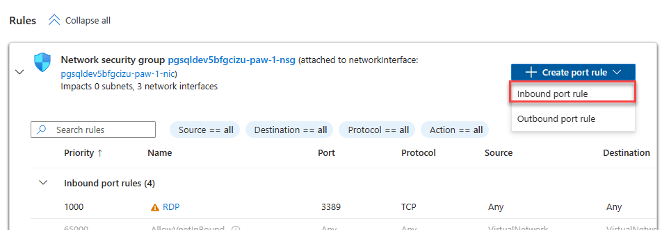
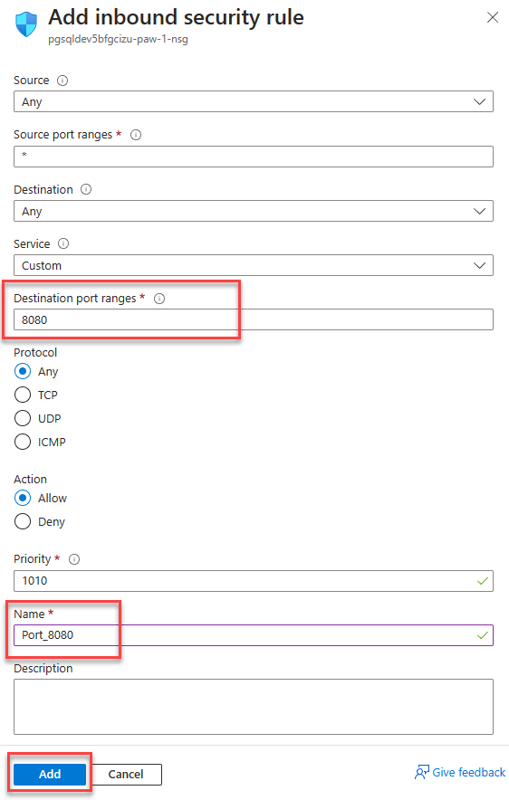
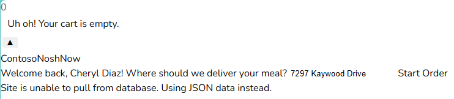
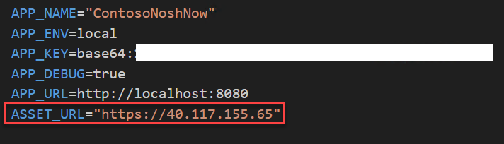
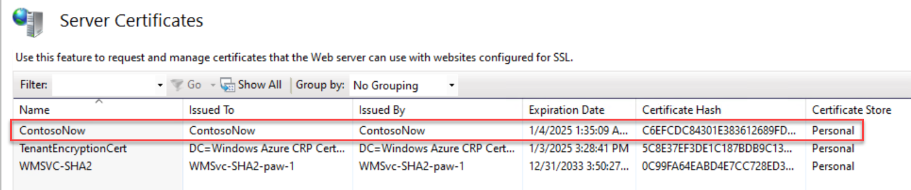
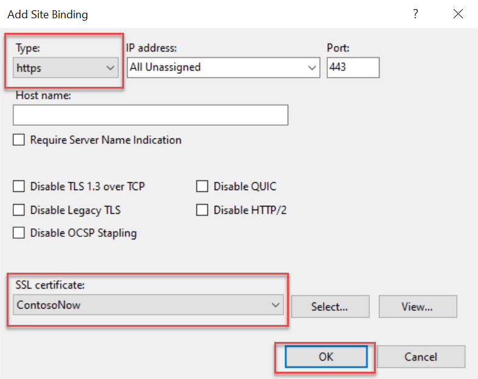
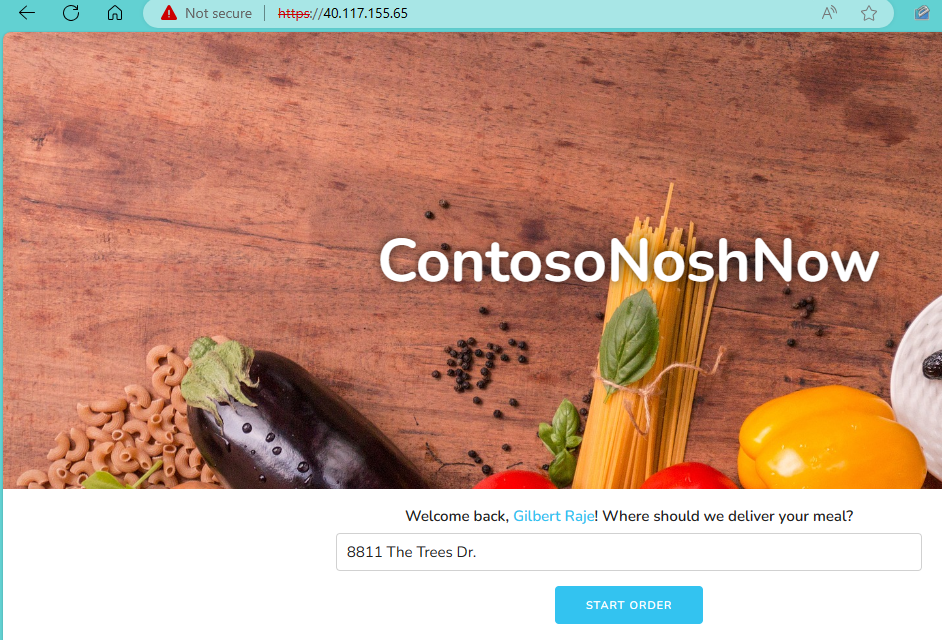

# AppMod 03 : Cloud Deployment to Azure VM

This is a simple app that runs PHP code to connect to a PostgreSQL database.

The app is running in an Azure VM and the App needs to be exposed to the internet via port 80 in order results to display.

## Required Resources

You will need to have completed the [Classic Deploy](../11-01-ClassicDeploy/README.md) steps to complete this lab.

Several resources are required to perform this lab. These include:

- Azure Virtual Machine (Development Server with web server and PHP)
- Composer

Create these resources using the PostgreSQL Flexible Server Developer Guide Setup documentation. **Note the last section that requires you to run the provided setup PowerShell script**:

- [Deployment Instructions](../../../11_03_Setup/00_Template_Deployment_Instructions.md)

## Test the Application #1

1. Open a browser to the Azure Portal.
2. Navigate to the **pgsqldevSUFFIX-win11** virtual machine.
3. In the **Essentials** section, copy the public IP Address.

   

4. Open a browser to the virtual machine ip address (ex `http:\\IP_ADDRESS:8080`).
5. A **ERR_CONNECTION_TIMED_OUT** error should occur. This is because the network security group on the virtual machine does not allow port 8080 access.

## Open Port 8080

1. Navigate to the **pgsqldevSUFFIX-win11** machine, select it.
2. Under **Networking**, select **Network settings**.
3. In the **Rules** section, expand the **Create port rule** button and select the **Inbound port rule** option.

   

4. For the destination port, type **8080**.
5. For the name, type **Port_8080**.
6. Select **Add**.

   

## Test the Application #2

1. Retry connecting to the web application (ex `http:\\IP_ADDRESS:8080`), notice another timeout error
2. Switch back to the **pgsqldevSUFFIX-win11** machine, run the following PowerShell command:

   ```PowerShell
   New-NetFirewallRule -DisplayName 'Port 8080' -Direction Inbound -Action Allow -Protocol TCP -LocalPort 8080
   ```

3. Open a browser to the virtual machine ip address (ex `http:\\IP_ADDRESS:8080`)
4. The results should be displayed, but some files will not be download

   

## Edit .env file

1. Open the `c:\labfiles\microsoft-postgres-developer-guide\artifacts\sample-php-app\.env` file
2. Edit the `APP_URL` to the `IP_ADDRESS` of the virtual machine and remove the port `8080`. 
3. Change the http protocol to `https` in order to properly load the application over SSL, example: https://IP_ADDRESS
4. Save the file.

   

## Enable Port 443

As part of any secured web application, SSL/TLS should be enabled.

1. Create a certificate on web machine by running the following command in PowerShell:

    ```powershell
    New-SelfSignedCertificate -FriendlyName ContosoNow -DnsName ContosoNow -CertStoreLocation Cert:\LocalMachine\My -KeyUsage DigitalSignature
    ```

2. See the certificate on the site:
   - Open Internet Information Services (IIS) Manager
   - Select the server node
   - Select **Server certificates**

      
   - Locate **ContosoNow** in the list

      

3. Setup SSL
   - Expand the **Sites** node
   - Select the **contosostore** web site
   - In the actions, select **Bindings**
   - Select **Add**
   - For the type, select **https**
   - For the SSL certificate, select **ContosoNow**
   - Select **OK**

   

## Open Port 443

1. In the Azure Portal, navigate to the **pgsqldevSUFFIX-win11** machine, select it
2. Under **Networking**, select **Network settings**
3. In the **Rules** section, expand the **Create port rule** button and select the **Inbound port rule** option

   

4. For the destination port, type **443**
5. For the name, type **Port_443**
6. Select **Add**

   

## Test the Application #3

1. Retry connecting to the web application (ex `https:\\IP_ADDRESS:443`), an error should occur.
2. Switch back to the **pgsqldevSUFFIX-win11** machine, run the following PowerShell:

   ```PowerShell
   New-NetFirewallRule -DisplayName 'Port 443' -Direction Inbound -Action Allow -Protocol TCP -LocalPort 443
   ```

3. In IIS restart the **contosostore** web site
4. Select the **Advanced** button
5. Select **Proceed to IP_ADDRESS (unsafe)**
6. The application should load
7. Open a browser to the virtual machine ip address (ex `https:\\IP_ADDRESS:443`)
8. The results should display

   
